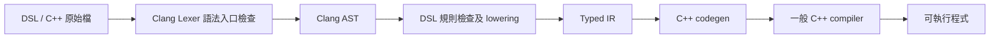

# DSL compiler lab

獨立的 C++ DSL compiler 原型：由 **Clang LibTooling** 解析合法 C++ 的受限子集，檢查 DSL 規則，建立自訂 typed IR，再從 IR 生成 C++23。生成結果交給一般 C++ compiler 編譯，這個工具本身不執行 kernel。



## Function object 與計算 library

新增 `--emit-objects` 模式：DSL 可以接收外部 event struct，將已登記的外部資料讀取抽成 context binding，生成可 include 的 C++23 function objects、contracts 與 unit 介面。

```sh
build/dslc examples/operations/price_difference.dsl.cpp \
  --emit-objects --extern-header examples/operations/market.h \
  --dsl-library examples/operations/pricing.dsl.h \
  --context-function get_bid --context-function get_ask \
  --dump-ir -o build/prices.generated.h
```

一般 C++ 呼叫方式：

```cpp
const ext_event event{.instrument_id = 0, .reference_price = 99.0};
const auto ctx = prepare_price_difference_context(event);
dsl_runtime::unit<price_difference> calculation;
auto result = calculation.on_event(ctx, event);
```

也可以直接傳入自行準備的 context，完全不呼叫外部 provider。Object 模式已支援 `if/else`、`&&/||/!`、early return、區域賦值、flat record result、明確的 `State&` 與 typed error。DSL 的 `throw Error{...}` 生成 `std::unexpected`，`unit` 僅在整次計算成功時提交 state。Intent 仍為空型別，暫不加入路由語意。

Library 可附 JSON 設定供新作者匯入，省去逐一登記依賴：

```sh
build/dslc examples/stateful/accumulate.dsl.cpp \
  --config examples/stateful/project.json -o build/accumulate.generated.h
```

完整規則見 [function objects](docs/function-objects.md)、[state／error 與可執行範例](docs/state-and-errors.md)、[library 設定](docs/library-config.md)。目前仍不支援迴圈、陣列、整數算術、任意數值轉型或獨立巢狀 state；硬體 backend 尚未實作。

## 依賴與固定版本

- **LLVM 20.1.8、Clang 20.1.8**，包含 LLVM 開發套件、Clang AST／LibTooling 標頭及 `libclang-cpp`。
- CMake ≥ 3.20、Ninja，以及支援 `std::expected`、`std::format`、`std::print`、`std::views::enumerate` 的 C++23 compiler／標準函式庫；本次使用 **GCC 16.1.0 + libstdc++ 16.1.0** 建置 compiler。
- Python ≥ 3.8，僅供 CTest 的整合測試使用，不是 compiler 的執行依賴。

Ubuntu／Debian 在已設定提供此 LLVM 版本的套件來源後，可安裝：

```sh
sudo apt-get install clang-20 llvm-20-dev libclang-20-dev libclang-cpp20 cmake ninja-build python3
```

上面的套件安裝指令提供 Clang／LLVM 依賴；host compiler 及其標準函式庫需另外符合上述 C++23 功能需求。CMake 會實際編譯並連結功能探測程式，缺少功能時直接說明原因。

請確認 LLVM／Clang 套件實際提供 **20.1.8**。CMake 以 `EXACT` 檢查 LLVM 版本，並檢查 Clang 標頭版本。CLI 的 `--version` 會列出編譯時固定的 LLVM 版本與實際連結的 Clang 版本；每次 configure 也會產生 `build/build-info.txt`，記錄版本、標頭、library 與 host compiler 路徑。

實體 library、多函數 DSL、前向宣告與遞迴見 [Runtime 與函數呼叫](docs/runtime-and-functions.md)。

數學函數、比較、條件選值的完整語法與範例見 [數學運算說明](docs/math.md)。

實作流程、設計理由與 C++23 重構內容見 [實作說明](docs/implementation.md)。本次環境與完整驗證紀錄見 [docs/validation.md](docs/validation.md)。

## 建置與測試

```sh
cmake -S . -B build -G Ninja \
  -DCMAKE_BUILD_TYPE=Release \
  -DCMAKE_C_COMPILER=gcc \
  -DCMAKE_CXX_COMPILER=g++ \
  -DLLVM_DIR=/usr/lib/llvm-20/lib/cmake/llvm
cmake --build build -j2
ctest --test-dir build --output-on-failure
build/dslc --version
```

範例中的 `g++` 應指向具備上述標準函式庫功能的版本。Host compiler 用來建置 `dslc`；解析 DSL 的 Clang LibTooling 仍固定為 20.1.8。若既有 build 使用不同 compiler，請使用新的 build 目錄，或以 CMake ≥ 3.24 的 `--fresh` 重新 configure。

若開發標頭或 shared library 位於非標準位置，可另外傳入：

```sh
-DDSL_CLANG_INCLUDE_DIR=/path/to/llvm-20/include
-DDSL_CLANG_CPP_LIBRARY=/path/to/libclang-cpp.so.20.1
```

這兩項與 `LLVM_DIR` 必須指向同一 LLVM／Clang release。CMake 直接尋找 LibTooling 標頭及 `clang-cpp`，不要求整組 Clang 靜態 library targets。停用測試可加 `-DBUILD_TESTING=OFF`。

## 執行驗收範例

輸入 [examples/average.dsl.cpp](examples/average.dsl.cpp)：

```cpp
double compute(double a, double b) {
    const double sum = a + b;
    return sum * 0.5;
}
```

生成 C++，同時顯示 IR，再與外部 driver 一起編譯、執行：

```sh
build/dslc examples/average.dsl.cpp --dump-ir -o build/average.cpp
g++ -std=c++23 -O2 -fno-fast-math -ffp-contract=off \
  -Iruntime/include build/average.cpp examples/driver.cpp \
  build/runtime/libdsl_runtime.a -o build/average
build/average
# 3
```

CLI：

```text
dslc [--dump-ir] [--config path]... [--emit-objects] <input.cpp> -o <output>
dslc --version
dslc --help
```

`--dump-ir` 輸出到 stdout；診斷輸出到 stderr。成功回傳 0，語法、DSL、參數或 I/O 錯誤回傳非 0。輸入固定以 C++23 解析，副檔名不影響語言。`--` 後可指定以 `-` 開頭的輸入檔名；`-o` 必須放在 `--` 前。

只有編譯與寫入完整成功後才替換輸出檔；拒絕的輸入不會清空既有輸出，也不允許輸入和輸出為同一檔案（含 symlink／hardlink）。

## Scalar 模式的 DSL 語法

- 輸入可以有多個全域 DSL 函數，必須有一個 `compute` 入口；所有函數的參數與回傳型別是未加限定詞的 `double`。
- 支援同檔案 helper 呼叫、前向宣告及遞迴；所有 DSL 宣告必須有定義，不支援 overload。
- 支援以 `--extern-header <path>` 登記的外部 C／C++ double 函數；DSL 明確 include 介面，生成程式連結外部實作。
- 區域變數可為已初始化的 `const double` 或 `const bool`，並可引用參數及已初始化的區域值。
- 接受 double 浮點常數、`true`、`false`、二元 `+ - * /`、一元 `+ -` 和括號。
- 數學函數：`abs`、`sqrt`、`pow`、`exp`、`log`、`sin`、`cos`、`tan`、`min`、`max`、`floor`、`ceil`、`round`。
- 比較：`< <= > >= == !=`，double operand 產生 bool 結果。
- 條件選值：`condition ? x : y`，條件為 bool，兩分支同型別；只執行被選中的分支。
- 函數本體只有區域宣告與最後唯一的 `return expr;`；接受空白和註解。

```cpp
#include <dsl_runtime/math.h>

double compute(double a, double b) {
    const bool positive = a >= 0.0;
    const double root = positive ? dsl_math::sqrt(a) : 0.0;
    return dsl_math::max(root, dsl_math::abs(b));
}
```

數學函數需要明確 `#include <dsl_runtime/math.h>`，以 `dsl_math::sqrt` 等限定名稱呼叫。實作位於 `runtime/src/math.cpp`，生成程式連結 `dsl_runtime`；其中 min／max 使用標準函式庫的 fmin／fmax。所有數學 API 只接受 double。

整數、float 與 bool 不會自動轉成 double，例如 `pow(a, 2)` 必須改寫為 `pow(a, 2.0)`。條件也不接受數值 truthiness，`a ? b : c` 必須改成明確比較。負數常數 `-1.0` 已支援。

其他語法仍拒絕，包括未登記的外部函數呼叫、`auto`、可變變數、賦值、`if`／迴圈、`&&`／`||`／`!`、數值轉型、指標、template、attributes、額外 block、未登記的 header include、其他前處理指令及巨集。數學規則見 [docs/math.md](docs/math.md)，外部介面、C linkage 與完整編譯範例見 [docs/external-functions.md](docs/external-functions.md)。

錯誤會包含原始檔名、行號、欄位及原因，例如：

```text
input.cpp:2:14: error: DSL: implicit conversions are not supported; use double literals and values
```

不合法的 C++ 由 Clang 診斷；啟用 `-pedantic-errors -Werror`，因此部分拒絕會先收到 Clang 原生的錯誤。Lexer 入口使用 token 允許清單，確保 `#if 0` 隱藏的內容、前處理指令與 AST 可能忽略的 attributes 不會漏過。這裡使用的是 **Clang 的 lexer 及 parser**，沒有自行撰寫 C++ parser。

## AST → IR → C++

驗收範例的 `FunctionDecl` 包含 `a`、`b` 兩個 `ParmVarDecl`，body 裡有 `sum` 的 `VarDecl` 與 `ReturnStmt`。

1. 參數建立 `%0`、`%1`，型別都為 `double`。
2. `sum` initializer 的 `BinaryOperator(+)` 降成 `%2 = add %0, %1`。Clang 的 `LValueToRValue` 隱式 cast 僅表示讀值，lowering 會移除；C++23 回傳變數時另有不改變型別和值的 `NoOp` 隱式節點，也會移除；其他隱式轉型拒絕；bool 的一般讀值也可移除。
3. `sum` 綁定為 `%3 = ref %2`；之後的 `DeclRefExpr(sum)` 引用 `%3`。
4. `FloatingLiteral(0.5)` 降成 `%4`。常數以 double 值存於 IR，序列化為精確的十六進位 `0x1p-1`，不複製來源字面文字。
5. `BinaryOperator(*)` 降成 `%5 = mul %3, %4`，`ReturnStmt` 指向 `%5`。

完整 IR：

```text
func @compute -> double {
  %0 : double = param a
  %1 : double = param b
  %2 : double = add %0, %1
  %3 : double = ref %2 (sum)
  %4 : double = constant 0x1p-1
  %5 : double = mul %3, %4
  return %5
}
```

IR 的 value ID 就是 `values` vector 的索引；每個值都有 `Type::Double` 或 `Type::Bool`。`Region` 指定執行序列及結果，`Function::body.result` 指定回傳值；`Select` 的兩個 region 只執行其中之一。括號不需要獨立 IR 節點，Clang 已把優先序與括號轉成 AST 的樹狀結構，lowering 保留該結構。

Codegen **只接收 Module IR**，沒有 Clang AST 或輸入原始碼的存取權。它用 value ID 生成安全的名稱，每個 IR 指令產生一個 `const double` 敘述：

```cpp
double compute(double v0, double v1) {
    const double v2 = (v0 + v1);
    const double v3 = v2;
    const double v4 = 0x1p-1;
    const double v5 = (v3 * v4);
    return v5;
}
```

## 浮點語意與測試

IR 不做常數折疊、代數化簡、重排或其他最佳化。運算依 AST 由左到右建立，每個 binary node 對應獨立 C++ 敘述；常數使用不受 locale 影響的精確 hexfloat 輸出。

**生成結果需以 `-fno-fast-math -ffp-contract=off` 編譯**，避免一般 C++ compiler 重結合運算或將乘加收縮成 FMA。這個原型以 IEEE-754 binary64、一般預設浮點環境為前提，沒有跨平台 extended precision 或動態 rounding mode 的保證。執行時的除零、Inf／NaN 等遵循一般 double 運算，不另外插入檢查。

CTest 會執行真實 CLI，再用設定的 host C++ compiler 在 `-O2` 下編譯生成結果及原始 C++ reference，執行並逐位元比較，也檢查已知預期值。包含 58 組運算案例及 9 組多函數案例，涵蓋：

- 驗收範例、四則運算優先序、括號、減法與除法結合方向、區域變數及名稱碰撞，以及 C++23 直接／括號回傳變數的 AST 差異。
- 對浮點重結合與 FMA 敏感的輸入、負零、最小 subnormal、最大有限 double、常數精度。
- 外部 C17／C++23 object 連結、漏連結失敗、具副作用的參數順序與 lazy 分支、header 巨集隔離，以及外部介面拒絕測試。
- 98 組基本語法拒絕案例，各檢查非零退出碼、位置、原因、沒有 IR 輸出且既有檔案未變動。
- 數學函數、比較、bool、巢狀條件選值；另檢查未選分支的浮點例外／errno，以及 NaN／Inf。
- 零參數與未命名參數、CLI 使用錯誤、缺少輸入、輸出路徑錯誤及同檔案保護。

## C++23 下的實作風格

| 寫法 | 使用位置與目的 |
| --- | --- |
| `std::expected<T, std::string>` | CLI 參數解析、檔案輸出明確回傳成功值或錯誤原因。 |
| `std::span`、`std::string_view` | 以非擁有的 view 讀取 argv 和原始碼，減少複製與手動索引。 |
| `std::visit` + 明確列出的 overloads | IR 顯示與 codegen 處理每一種 operation；新增 variant alternative 而未補上處理時會編譯失敗。 |
| `std::views::enumerate` + structured bindings | 同時取得 value ID 與值引用，移除重複的索引迴圈。 |
| `std::format`、`std::print` | 格式化診斷、IR 與生成程式；浮點常數以精確十六進位格式輸出。 |
| RAII `OutputFile` | 將 LLVM 暫存檔的 keep／discard 規則集中管理，失敗離開作用域時自動清理。 |
| `[[nodiscard]]`、designated initializers | 標示需檢查的結果，讓 IR 建構時各欄位的用途明確。 |

`formatIR(Module)` 與 `generateCpp(Module)` 直接回傳字串，呼叫端負責輸出。`compile()` 保留 `std::optional<Module>`，因為帶有位置的診斷已由 Clang 發出。AST 指標是 Clang 擁有物件的非擁有引用；保留 `llvm::dyn_cast` 以配合 Clang 的節點模型。

生成的 kernel 使用明確的 `double` 參數與逐步 `const double` 計算，這與 C++23 相容，也方便檢查每一步浮點運算。它不需要 compiler 自身使用的格式化或 ranges 函式庫。

## 建議閱讀順序與模組責任

1. [include/dsl/ir.h](include/dsl/ir.h)：最小 typed IR，參數、常數、運算、值引用與 return 的資料表示。
2. [src/frontend.cpp](src/frontend.cpp)：Clang lexer／巨集檢查、AST 規則驗證、declaration 綁定及 lowering。
3. [src/codegen.cpp](src/codegen.cpp)：純 IR → C++，可直接對照上面的驗收範例。
4. [src/ir.cpp](src/ir.cpp)：使用 visitor 格式化 IR、型別與運算名稱、精確浮點常數輸出。
5. [src/main.cpp](src/main.cpp)：CLI、輸入讀取、錯誤碼與輸出檔替換。
6. [include/dsl/math.h](include/dsl/math.h)：數學 API metadata，供實體 header 的 AST 驗證與 runtime 呼叫 codegen 使用。
7. [runtime/include/dsl_runtime/math.h](runtime/include/dsl_runtime/math.h)、[runtime/src/math.cpp](runtime/src/math.cpp)：實體數學 library 的公開 API 與實作。
8. [src/objects.cpp](src/objects.cpp)、[runtime/include/dsl_runtime/operation.h](runtime/include/dsl_runtime/operation.h)：Object lowering／codegen 與 contract／unit。
9. [src/config.cpp](src/config.cpp)：JSON library 設定與相對路徑、imports 驗證。
10. [tests/objects.py](tests/objects.py)：Object、library 與 context binding 的端到端驗證。
10. [tests/integration.py](tests/integration.py)：語言邊界、浮點運算與端到端驗證。

沒有加入 LLVM IR、MLIR、JIT、Python binding 或 FPGA 後端。Object 模式的函數展開用於建立完整 context 需求；尚未加入一般最佳化 pipeline。

Clang API 背景可參考官方 [LibTooling 文件](https://clang.llvm.org/docs/LibTooling.html)；本專案實際編譯並驗證的是 20.1.8 標頭。
