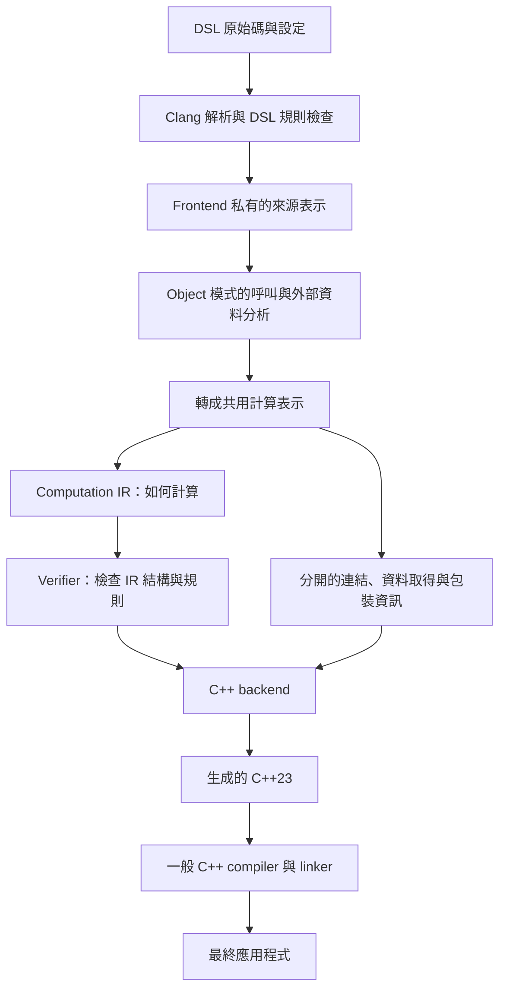
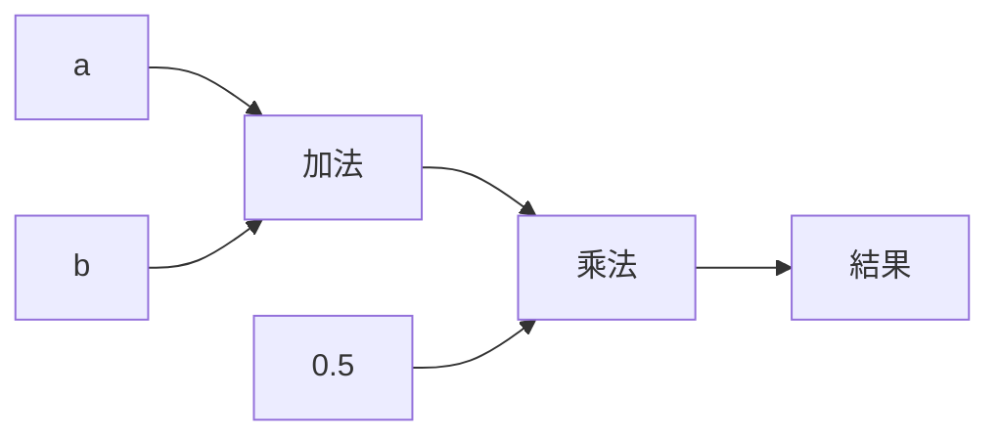

# 從零理解這個 DSL compiler

這份文件寫給沒有學過 compiler 的讀者。只要大致看得懂函數、變數、`if` 與 `struct`，就可以從頭閱讀；不需要先懂 Clang、LLVM 或 IR。

我們會從「兩個數字取平均」開始，一路看它如何變成 compiler 裡的資料，再變成可執行的程式。接著加入條件、外部資料、state 與 error，最後對照 Clang／LLVM 的實際流程。

本文依據目前 repo 的程式碼撰寫。範例中的 **實際輸出** 來自本機工具；標示為 **概念示意** 的片段則省略機械性的編號或包裝，不能直接當成 compiler 的輸入。正式資料結構另見 [IR 架構文件](ir-architecture.md)。

第一次閱讀可分成四段：第 1–6 節理解文字如何變成 IR；第 7–13 節理解分支、外部資料、state、error 與生成；第 14 節對照成熟 compiler；第 15–20 節實際操作、找程式碼與了解限制。看到不熟悉的檔案名稱可以先跳過，不需要一開始就讀原始碼。

## 1. Compiler 到底在做什麼？

**Compiler，編譯器**，負責把一種程式表示轉換成另一種表示，同時檢查它是否符合語言規則。

它不一定直接產生 CPU 指令。本專案產生 C++ 原始碼，這種形式叫做 **source-to-source compiler，原始碼到原始碼的編譯器**。產生的 C++ 再交給一般 C++ compiler，才得到可執行程式。

**DSL** 是 Domain-Specific Language，意思是「為特定用途設計的語言」。這裡的用途是組合計算。它沿用部分 C++23 語法，所以作者可以寫熟悉的函數和 struct，但不能使用完整 C++ 的所有功能。

例如：

```cpp
double compute(double a, double b) {
    const double sum = a + b;
    return sum * 0.5;
}
```

這段程式同時是合法 C++，也是目前接受的 DSL。但「合法 C++」不代表「合法 DSL」：例如一般迴圈目前仍不接受。

### 1.1 先區分三個不同的程式

| 程式 | 工作 | 什麼時候執行？ |
| --- | --- | --- |
| `dslc` | 讀 DSL、檢查、建立中間資料、產生 C++ | 你生成計算程式時 |
| `g++` 或 `clang++` | 把生成的 C++ 編譯並連結成可執行程式 | 你建置最終應用程式時 |
| 最終應用程式 | 接收事件、取得外部資料、計算、更新持久狀態 | 系統真正處理資料時 |

**編譯期，compile time**，指程式正在被翻譯、檢查的階段。**執行期，runtime**，指翻譯完成的程式正在處理實際資料的階段。

因此，執行 `dslc` 時，compiler 並不會去取得現在的 bid／ask，也不會把 Accumulator 的 total 加上一筆真實交易。它只是產生「未來遇到資料時該怎麼做」的程式。

### 1.2 本專案用 Clang，但輸出不必經 LLVM IR

**Clang** 是處理 C／C++ 等語言的編譯器工具。**LLVM** 是一套 compiler 基礎設施，提供中間表示、程式轉換與多種機器的程式生成能力。

我們使用 **LibTooling**，也就是可在自己的 C++ 工具中使用 Clang 解析能力的 library（函式庫，也就是可由其他程式重用的一組程式功能）。因此不必自己重寫 C++ 的文法解析器。[Clang LibTooling 官方說明](https://releases.llvm.org/20.1.0/tools/clang/docs/LibTooling.html)

目前本專案的 compiler 建置使用 GCC 16.1.0，而內部解析 DSL 的 library 是 Clang 20.1.8。這兩件事並不衝突：一個負責把 `dslc` 建出來，另一個是 `dslc` 執行時使用的解析工具。

## 2. 先看整體架構

這裡先定義四個會反覆出現的名詞：

| 名詞 | 白話意思 |
| --- | --- |
| Frontend，前端 | 理解來源語言：這段程式寫了什麼、是否有效。與網頁前端無關。 |
| IR，Intermediate Representation，中間表示 | Compiler 自己整理出的程式資料，方便檢查與轉換。 |
| Backend，後端 | 把 IR 轉成指定目標的程式。與伺服器後端無關。 |
| Codegen，code generation，程式碼生成 | 實際產生輸出程式的工作；目前屬於 C++ backend。 |

現在的流程是：



圖中的 **verifier，驗證器**，會檢查中間表示是否符合內部規則，例如不能引用不存在的值。它不執行應用程式，也不判斷商業公式是否正確。

Scalar 模式會略過 object 專用的呼叫展開與 context 分析。**Scalar，純量**，在這裡指單一數值；不是向量或矩陣。Object 模式則產生可呼叫的 C++ 物件，後面會詳細說明。

### 2.1 為什麼需要這麼多步？

每一步解決不同問題：

- Clang 最擅長理解 C++ 的語法與名稱。
- DSL 規則決定我們願意支援哪些計算。
- 共用 IR 明確記錄值、運算和分支，方便不同 backend 重用。
- C++ backend 才知道要產生哪些 C++ struct、函數與 library 呼叫。

如果直接把來源函數文字貼進輸出，今天也許可以編譯，但未來要改成硬體指令時，就沒有可供轉換的計算資料。本專案會真正重建運算與值的關係，再由那些資料生成程式。

## 3. 第一步：從文字看出程式結構

先使用 repo 的 [average.dsl.cpp](../examples/average.dsl.cpp)：

```cpp
double compute(double a, double b) {
    const double sum = a + b;
    return sum * 0.5;
}
```

### 3.1 Lexer：把文字切成 token

**Lexer，詞法分析器**，把文字辨認為一個個 **token，詞彙單位**。例如 `a + b` 可以分成名稱 `a`、運算符號 `+`、名稱 `b`。

`double` 是型別關鍵字，`compute` 是名稱，`(`、`)`、`{`、`}` 是符號，`0.5` 是數值常數。空白與註解通常不構成計算本身。

本專案使用 Clang 的 lexer，另外檢查來源 token 是否在 DSL 允許範圍內。這個檢查不負責理解 `a + b * c` 的優先順序；那是下一階段的工作。

### 3.2 Preprocessor：先處理 include 等指令

**Preprocessor，前處理器**，處理 `#include`、巨集與條件編譯等內容。

**Header，標頭檔**，提供函數或型別的宣告。`#include` 讓 Clang 看見那些宣告。**Macro，巨集**，則是前處理階段的 token 替換規則，例如 `#define`。

DSL 不開放任意前處理。Compiler 會檢查 include 是否來自允許的 runtime、外部介面或已登記的 DSL library，並限制 DSL 中的巨集使用。

為什麼不能只檢查後面的語法樹？因為 `#if 0` 內的文字可能先被移除，後面的語法樹根本看不到它。原始 token 檢查可以避免這類內容繞過 DSL 的限制。

### 3.3 Parser 與 AST：建立結構

**Parser，語法分析器**，理解 token 之間的組合關係，例如哪些參數屬於哪個函數、乘法是否在加法裡面。

**AST** 是 Abstract Syntax Tree，**抽象語法樹**。它用樹狀資料表示程式的結構，不再只是文字。

平均值範例的 AST 可以簡化成：

```text
函數 compute
├─ 參數 a：double
├─ 參數 b：double
└─ 函數本體
   ├─ 宣告 sum：const double
   │  └─ 初值：加法
   │     ├─ 讀取 a
   │     └─ 讀取 b
   └─ return
      └─ 乘法
         ├─ 讀取 sum
         └─ 常數 0.5
```

這是實際 AST 的閱讀版，省略記憶體地址、原始碼座標和部分輔助節點。

在 [frontend.cpp](../src/frontend.cpp) 會遇到的 Clang 類別，可以這樣讀：

| Clang 名稱 | 代表什麼？ |
| --- | --- |
| `FunctionDecl` | 函數宣告或定義 |
| `ParmVarDecl` | 函數參數 |
| `VarDecl` | 變數宣告 |
| `DeclRefExpr` | 在表達式裡引用某個已宣告的變數或函數 |
| `BinaryOperator` | 有左右兩個輸入的運算，例如加法 |
| `FloatingLiteral` | 浮點常數，例如 0.5 |
| `ReturnStmt` | return 敘述 |

**Declaration，宣告**，告訴 compiler 某個名稱及其型別存在。**Definition，定義**，還提供實際內容，例如函數本體。`double sqrt(double);` 是宣告，帶 `{ ... }` 的函數則提供定義。

### 3.4 Semantic analysis：不只看形狀，還看意思

**Semantic analysis，語意分析**，檢查名稱指向誰、型別是否相容、函數引數是否正確等問題。

假設有兩個不同作用域都叫 `x`，不能只搜尋字串 `x` 來決定讀哪一個。Clang 已經把每次引用連到正確的宣告；frontend 利用這個連結建立自己的值表。

**Scope，作用域**，指某個名稱在哪一段程式內有效。例如 block（以大括號包住的程式區塊）內宣告的變數通常只能在那個 block 使用。

AST 也會包含來源沒有明寫的型別轉換。**Implicit conversion，隱式轉換**，就是 compiler 自動插入的轉換。讀取變數的值，與把 `int` 轉成 `double`，在 AST 中都可能以輔助節點出現，但兩者意義不同。

本專案只移除明確允許、沒有改變數值型別的讀值節點，並依模式接受少量例外；不會把所有隱式轉換一律放行。

## 4. 第二步：合法 C++ 還要符合 DSL 規則

Clang 理解完整 C++，本專案只接受其中一部分，所以 frontend 還有自己的允許清單。

| 輸入情況 | 哪一層會指出問題？ |
| --- | --- |
| 括號不完整、缺少宣告 | Clang 語法／語意診斷 |
| 使用尚未開放的迴圈或數值轉型 | DSL token／AST 檢查 |
| include 未登記的外部介面 | Header 檢查 |
| provider 依賴可變 state 或只在某個條件分支讀取 | Object 模式的資料取得分析 |
| 內部 IR 引用不存在的 ValueId | 獨立 verifier |
| 核心型別合法，但 C++ backend 尚未支援 | Backend 能力檢查 |

例如 scalar 模式中的 `a + 1` 會要求把整數常數改寫成 `1.0`；object 模式則有限定允許運算中的整數常數提升為 double。兩種模式的語法規則並不完全相同，詳見 [數學語法](math.md) 與 [function objects](function-objects.md)。

Frontend 先收集所有函數的 **signature，簽名**，也就是輸入型別、輸出型別等資訊，再檢查函數本體。因此 helper（輔助函數，也就是供其他函數組合呼叫的函數）可以引用已宣告、但還沒有完成內部轉換的另一個函數。未被呼叫的函數也會檢查，不會因此逃過規則。

## 5. 第三步：先整理來源，再建立共用 IR

### 5.1 為什麼有 frontend 私有表示？

目前有兩套用途不同的內部資料：

| 資料 | 所在檔案 | 用途 |
| --- | --- | --- |
| Frontend 私有來源表示 | [frontend_ir.h](../src/frontend_ir.h) | 記住 DSL 來源中的變數、賦值、成員與呼叫，方便做來源規則分析。 |
| 共用 computation IR | [ir.h](../include/dsl/ir.h) | 明確表示值、型別、運算與控制流程，交給不同 backend 使用。 |

「私有」表示這是 frontend 的內部細節，不是給 backend 接入的介面。

例如私有表示仍有 `Store`，代表來源賦值；還有 `ContextRead`，代表需要外部準備的資料。它們會在 [semantic.cpp](../src/semantic.cpp) 轉換掉，不會原樣流入共用 IR。

**Lowering** 在 compiler 裡指把一種表示轉成下一種較適合後續處理的表示；可以理解為「把抽象的意思拆成更明確的步驟」。它不必一步到達機器指令。

### 5.2 Object 模式還會分析呼叫和資料取得

**Call graph，函數呼叫圖**，記錄哪個函數會呼叫哪個函數。例如 `price_difference → mid_price`。

Object 模式會在 [frontend_bindings.cpp](../src/frontend_bindings.cpp) 沿呼叫關係分析需要哪些 context 資料，也會檢查 error 型別是否能互相傳播。

目前這個階段會 **inline，展開** helper：把被呼叫函數的內部計算展開到呼叫位置，但保留它自己的 return 邊界。這樣才能收集外層計算完整的資料需求。這是目前 object 模式的實作策略，不是要求所有未來 backend 都必須先展開所有函數。

Scalar 模式保留明確的函數呼叫，也保留原有遞迴支援。**Recursion，遞迴**，指函數直接或間接呼叫自己；object 模式目前拒絕這種呼叫關係。

## 6. 共用 IR 是什麼樣的資料？

### 6.1 Module：一份計算集合

**Module，模組**，在這裡是 compiler 的一份計算集合，不是 C++20 的 `module` 語法。

`ir::Module` 有四張主要表：

```text
Module
├─ types：有哪些型別
├─ constants：有哪些精確常數
├─ externals：有哪些邏輯上的外部函數介面
└─ functions：有哪些計算函數
```

這些表存在 compiler 的記憶體中。IR dump 是把它們印成文字，方便人閱讀；compiler 不是靠重新解析自己的 dump 來繼續工作。

### 6.2 TypeId：用編號指向一個明確型別

**Type，型別**，規定一個值的表示與可用操作，例如 bool 或浮點數。

目前型別以互斥的選項表示：bool、整數、浮點數、record。**Record，紀錄型別**，就是把多個具名概念欄位組成一份資料，類似 C++ struct；在核心裡欄位使用 ID，C++ 名稱另存。

整數型別明確保存 **width，位元寬度**，以及 **signedness，是否帶正負號**。32 位元 signed 整數可表示負數，unsigned 則把範圍用於非負數。

浮點型別明確保存格式：**binary64** 是 IEEE-754 標準的 64 位元二進位浮點格式，本專案用它對應 double；**binary32** 則是 32 位元格式。IEEE-754 是定義浮點表示與運算的重要標準。

**TypeId** 是型別表的編號。例如 `!0` 指向 binary64。編號只是引用，不是記憶體地址，也不代表這個值已經住在某個硬體暫存器。

型別表不能出現「類別是 double，卻又附了一個 record 名稱」的矛盾組合。C++ 的 `std::variant` 用來表達這種「一次只能是其中一種」的選擇。

### 6.3 ValueId：每一個計算結果都有自己的身分

**Value，值**，是參數或運算產生的一份資料。**ValueId** 是函數內值表的編號，例如 `%2`。

平均值範例中：

| ID | 含義 |
| --- | --- |
| `%0` | 輸入 a |
| `%1` | 輸入 b |
| `%2` | a + b 的結果 |
| `%3` | sum 綁定到的值，目前保留一個 identity 操作 |
| `%4` | 常數 0.5 |
| `%5` | sum × 0.5 的結果 |

**Identity，恆等操作**，把已有值作為自己的結果，不改變它的內容。目前保留這個來源綁定步驟，沒有最佳化 pass 把它消除。

**Pass，處理階段**，指對程式表示進行某一項分析或轉換，例如移除不必要的 identity。現在沒有一般最佳化 pipeline，也就是沒有串接一系列最佳化 pass 的流程。

### 6.4 Operation：一步工作；result：這一步產生的資料

**Operation，簡稱 OP，操作**，表示一步工作，例如加法、比較、呼叫或條件分支。**Opcode，操作代碼**，表示這一步是哪一種工作。

一個 Operation 有：

| 欄位 | 白話說明 |
| --- | --- |
| `id` | 這個操作自己的 OperationId |
| `code` | 做什麼，例如 Add 或 Sqrt |
| `operands` | 輸入哪些值；operand 就是操作的輸入 |
| `results` | 定義哪些輸出值 |
| `attribute` | 額外固定資訊，例如要呼叫的 FunctionId |
| `regions` | 內含的計算區域，例如 if 的兩個分支 |
| `location` | 供錯誤診斷使用的來源位置資訊 |

**Attribute，附加屬性**，不等於 runtime 的輸入值。例如「呼叫第 3 個函數」是操作本身的固定資訊；「傳入 bid」則是 operand。

OperationId 與 ValueId 分開，因為「一步工作」不等於「一個值」。有的操作沒有結果，有的有一個，有的可以產生多個結果。參數本身也會定義值，但不需要假裝是加法那樣的 operation。

### 6.5 Registry：統一記錄 OP 的規則

**Registry，登記表**，在 [registry.cpp](../src/registry.cpp) 統一記錄 opcode、名稱、驗證規則與 effect 分類。

例如 Add 要兩個相同浮點型別的輸入，產生相同型別的結果；Sqrt 要一個浮點輸入；比較需要相容的數值輸入並產生 bool。

這樣 verifier 可以根據同一張表查規則。Frontend 負責把來源 `+` 辨認成 Add，C++ backend 負責把 Add 生成 C++ 加法。Registry 不會自動替新 OP 寫好數學演算法或所有 backend。

### 6.6 真正印出的平均值 IR

執行：

```sh
build/dslc examples/average.dsl.cpp --dump-ir -o build/average.cpp
```

目前實際輸出：

```text
computation_ir v1
type !0 = ieee754.binary64
type !1 = bool
type !2 = i32
constant #c0 : !0 = bits 0x3fe0000000000000
func @compute ( %0: !0 %1: !0 ) -> ( !0 ) {
  value %0 : !0
  value %1 : !0
  value %2 : !0
  value %3 : !0
  value %4 : !0
  value %5 : !0
  %2 = add %0, %1
  %3 = identity %2
  %4 = constant #c0
  %5 = mul %3, %4
  return_success %5
}
```

逐行看：

- `!0`、`!1`、`!2` 是型別表的引用；`i32` 表示 signed 32-bit integer。
- `#c0` 是常數表的引用；`0x3fe0000000000000` 是 0.5 的 binary64 **位元表示**，不是把這個十六進位整數拿去乘。
- 函數列寫出兩個 binary64 參數及一個 binary64 成功結果。
- `value` 列列出每個值的型別；接下來的操作才定義它們如何產生。
- `return_success` 表示函數成功結束，交出 `%5`。

參數、操作、結果都有型別，因此稱為 **typed IR，有型別的中間表示**。目前 TypeId 等 ID 在各自表格內有效；未來如果合併或重排表格，需要一起重編引用，不是跨檔案永久不變的全球編號。

## 7. 「計算圖」不是只有加減乘除的連線

**Computation graph，計算圖**，用節點和連線表達計算相依性：節點做運算，連線表示它需要哪個先前結果。



但有條件與外部呼叫之後，只知道值相依性還不夠。還要記錄哪些路徑會執行，以及哪些操作有可觀察的順序。

### 7.1 Region 與 terminator

**Region，區域**，在本專案中是一段有順序的操作序列，最後必須明確說明如何結束。

**Terminator，結束指令**，就是那個結束方式：

| Terminator | 意思 |
| --- | --- |
| `ReturnSuccess` | 結束目前函數／內嵌計算，交出成功結果。 |
| `ReturnError` | 結束目前計算，交出指定型別的錯誤。 |
| `Yield` | 結束目前分支，把結果交回包住它的 If／Scope。 |
| `Unreachable` | 前面的控制流程已經保證退出，所以不會繼續到這裡。 |

本專案的 Yield 是 IR 的分支結果交付，與 C++ coroutine 的 `co_yield` 無關。Coroutine 是可暫停再恢復的函數機制，目前 DSL 沒有支援它。

假設寫：

```cpp
return enabled ? positive : negative;
```

其概念 IR 是：

```text
selected = If(enabled)
  true region:
    Yield positive
  false region:
    Yield negative
ReturnSuccess selected
```

If 只執行其中一個 region。如果其中一邊有 `sqrt` 或外部函數，另一邊沒被選到時，不會偷偷先執行它。

### 7.2 Mutable 來源變數如何變成不可變值？

**Mutable，可變**，表示原始變數可以被賦值。IR 則讓每個 ValueId 只被定義一次。

例如以下 object 模式的來源片段：

```cpp
double x = a;
x = x + b;
return x;
```

概念上轉成：

```text
x0 = a
x1 = Add(x0, b)
ReturnSuccess x1
```

來源名字仍叫 x，但 frontend 的 **binding，綁定表**，會更新為「後續看到 x，要使用 x1」。沒有改寫 x0 的值。

這個「每個值只定義一次」的想法叫 **SSA，Static Single Assignment，靜態單一賦值**。這裡的「靜態」是在說程式表示中的定義方式，不是在說數值已於編譯時算好。

若 x 在 if 的不同分支更新，就讓兩個分支分別 Yield 自己的新值，再由 If 產生外部繼續使用的值。它仍是 SSA 式的值流，但本專案使用結構化 region，不是照搬 LLVM 的所有指令或控制流程結構。

### 7.3 Effect：為什麼有結果也不代表能任意重排？

**Effect，可觀察影響／副作用**，指運算除了交出值，還會影響外部可觀察的狀態。例如外部函數可能讀行情、增加計數器或寫紀錄。

浮點運算也可能影響 **浮點環境**，例如除零狀態旗標。數學 library 還可能改變 `errno`，也就是用來傳遞某些函式錯誤資訊的執行環境欄位。

Registry 對這些影響採保守分類。現在沒有 effect 推導或重排最佳化；region 順序會被保留。這表示 computation IR 不是「所有節點都可以任意平行執行」的許可證。

同理，不能因為某個外部呼叫的回傳值沒用到，就認定可以刪掉它。未來加 optimizer 時必須同時考慮值相依性、條件與 effect。

## 8. 為什麼把計算、C++、context 和 unit 分開？

**Metadata，附加描述資料**，在這裡用來說明計算如何接到外部環境。它不是不重要的資料，而是與「運算本身」不同的責任。

[program.h](../include/dsl/program.h) 的 `Program` 分成四份：

| 部分 | 回答的問題 | 例子 |
| --- | --- | --- |
| `computation` | 拿到輸入後，怎麼算？ | 把 bid 和 ask 相加，再除以 2。 |
| `cpp` | 怎麼接到 C++？ | 要 include 哪個 header，外部函數的 C++ 名稱是什麼。 |
| `bindings` | 輸入資料去哪裡取得？ | 用 event 的 instrument_id 呼叫 get_bid。 |
| `units` | 外部如何使用這個計算？ | 哪些函數公開、哪個參數是 state、state 初值是什麼。 |

**Linkage，連結資訊**，描述邏輯上的函數如何對應外部實作。**Symbol，符號**，是編譯與連結工具用來辨識函數、變數等實體的名稱。

**Envelope，外層包裝**，在 UnitEnvelope 的名字中指外部使用介面。它告訴 backend 哪些核心參數扮演 event／state 等角色。

同一個核心計算可以由 host 從資料庫、行情 API 或測試資料取得輸入。**Host** 在這裡指承載並呼叫計算的外部應用程式。

未來 ISA backend 需要的是計算、型別與自己的外部環境映射，不必理解 `#include` 或 C++ namespace（名稱空間）。**Target，目標**，在這裡指輸出程式所面向的語言、機器或執行環境。**ISA，Instruction Set Architecture，指令集架構**，是某個處理器對程式提供的指令和機器規則。

## 9. 數學函數、DSL helper、外部函數各怎麼處理？

這三種來源看起來都像 `f(x)`，但背後的實作來源不同：

| 來源寫法 | 共用 IR | C++ 生成 |
| --- | --- | --- |
| `dsl_math::sqrt(x)` | Sqrt opcode | 呼叫實體 `dsl_math::sqrt` |
| DSL helper，例如 `square(x)` | Scalar 模式用 Call + FunctionId | 呼叫生成的內部函數 |
| 已登記的外部函數 | ExternalCall + ExternalId，或 object 的 host binding | 呼叫外部實作，或由 context 參數供值 |

### 9.1 數學 runtime 是真的 library

**Runtime library，執行期函式庫**，提供生成程式執行時所需的函數。

本專案有真正的 [math.h](../runtime/include/dsl_runtime/math.h) 與 [math.cpp](../runtime/src/math.cpp)。作者明確 include，frontend 確認宣告身分，核心記錄 Sqrt，C++ backend 再生成 `dsl_math::sqrt` 呼叫。

目前 math.cpp 中的 sqrt 等實作使用標準數學函式庫。因此有三層不同的決定：來源作者用哪個 API（Application Programming Interface，程式介面，也就是提供給其他程式使用的函數或資料結構）、核心知道它是哪個數學 OP、target 最後用什麼實作。

未來另一個 backend 可以用硬體 sqrt 指令或自己的函式庫，但仍須符合決定支援的數值語意。不能只因為指令也叫 sqrt，就假定精度和特殊值行為完全相同。

### 9.2 Object helper 的 Evaluate 是什麼？

Object 模式目前展開 helper 後，用 **Evaluate，內嵌計算操作**，保留該 helper 的 return 邊界。

例如 parent 呼叫 child，child 的 return 應該回到 parent，不能直接讓 parent 整個結束。Evaluate 裡的 ReturnSuccess 就是結束 child，產生給 parent 的結果。

If／Scope 不新增這種邊界。在 child 的 if 裡面 return，仍然結束 child。這個差別是早退行為正確的關鍵。

### 9.3 外部函數的「宣告」不等於「實作已經連進來」

Header 裡寫 `double get_bid(int);`，只是讓 compiler 知道可怎麼呼叫。最終程式還需要連結提供函數本體的 library 或 object file。

**Object file，目的檔**，是已編譯、但還可能需要與其他檔案組合的機器碼檔案，通常副檔名為 `.o`。它與 C++ function object 是不同概念。

**Linker，連結器**，負責把目的檔與 library 組合，解析那些對外部符號的引用。缺少 get_bid 的實作時，就可能收到 undefined reference，意思是找不到那個外部符號的定義。

## 10. Context：外部讀取為什麼不放在核心計算裡？

使用 repo 的 [pricing.dsl.h](../examples/operations/pricing.dsl.h)，關鍵內容是：

```cpp
double mid_price(ext_event event) {
    double bid = get_bid(event.instrument_id);
    double ask = get_ask(event.instrument_id);
    double mid = (bid + ask) / 2;
    return mid;
}
```

這段放在 object 模式，並將 get_bid／get_ask 登記為 context functions。

**Event，事件輸入**，表示這次要處理的事情，例如哪一個 instrument。**Context，計算環境資料**，是這次計算所需、由外部先準備好的資料，例如 bid 和 ask。

**Provider，資料提供函數**，例如 get_bid。**Host binding，外部資料綁定**，記錄 provider 的結果要接到哪個核心輸入。

Compiler 會分開描述：

```text
資料取得：
  bid = get_bid(event.instrument_id)
  ask = get_ask(event.instrument_id)

核心計算：
  mid = (輸入 bid + 輸入 ask) / 2
```

核心裡的 bid／ask 是普通參數，不是特別的 C++ ContextRead 指令。C++ backend 再生成類似以下的介面；這是精簡示意：

```cpp
struct mid_price_context {
    double bid;
    double ask;
};

inline mid_price_context prepare_mid_price_context(const ext_event& event) {
    return {.bid = get_bid(event.instrument_id),
            .ask = get_ask(event.instrument_id)};
}
```

呼叫 `prepare_mid_price_context` 時才真正讀外部資料。Host 也可以自行建立 context，跳過這個準備函數。

### 10.1 為什麼有些 provider 寫法會拒絕？

考慮：

```cpp
return event.instrument_id > 0 ? get_bid(event.instrument_id) : 0.0;
```

如果 compiler 把 get_bid 無條件搬到最前面，條件為 false 時也會讀一次，行為就變了。所以目前 object 模式拒絕條件分支內的 provider 讀取；可能提前 return／error 之後的讀取也有類似限制。

Provider 引數只能來自目前支援的 event／常數取值，不允許依賴會變動的 state、被修改的 local（區域變數）或一般中間計算。這是為了讓資料準備能明確在核心計算之前完成。

目前不會把兩次相同 provider 呼叫合成一次：它們可能取得不同快照，也可能有讀取次數的效果。反過來說，依序讀 bid／ask 也不自動保證兩者屬於同一個市場快照；這仍是 provider／host 的責任。

這種 context 抽取是本 DSL 的專門設計，不能當成一般 C++ compiler 必然會做的最佳化。

## 11. State 與 error 如何變成計算的一部分？

**State，狀態**，是跨多次事件保留的資料。Context 通常是這次計算的外部輸入，state 則是這個計算實例之前留下來的值。

下面是完整、可由 object 模式接受的 DSL：

```cpp
struct LimitError {
    int code;
};

struct Accumulator {
    double total = 0.0;

    double operator()(double value) {
        total = total + value;
        if (total > 250.0) {
            throw LimitError{.code = 2};
        }
        return total;
    }
};
```

**Function object，可呼叫物件**，是定義 `operator()`、可以像函數一樣被呼叫的 C++ 物件。DSL 作者用熟悉的 struct 成員表達 state，不必手動把 State& 放進函數參數。

### 11.1 對核心而言，state 就是輸入值和輸出值

這段 DSL 的核心可以用以下概念表示：

```text
Accumulator(value, old_state) -> 成功(result, new_state) 或錯誤 LimitError

old_total = Extract(old_state, total 欄位)
new_total = Add(old_total, value)
new_state = Insert(old_state, total 欄位, new_total)

If(new_total > 250.0)
  true region:
    ReturnError LimitError{code = 2}
  false region:
    Yield

ReturnSuccess new_total, new_state
```

**Extract，取出欄位**，讀取 record 的一個欄位。**Insert，替換欄位得到新值**，回傳一份更新後的 record；它的核心語意不會修改原本的 old_state。

如果來源改寫 `total`，semantic 轉換就讓後續讀取使用新的 ValueId。核心沒有「先拷貝 mutable state、之後回滾」這種 C++ 執行策略。

### 11.2 實際生成時不一定真的複製所有記憶體

C++ backend 目前可以生成區域副本與欄位賦值來實作 Insert。一般 C++ compiler 隨後可能把這些暫存資料放在暫存器，或移除不必要的實體複製。

**Register，暫存器**，是處理器內部供指令快速使用的儲存位置。核心裡有多個 ValueId，不等於執行時必定配置同樣多個記憶體區塊。

因此我們分開看「邏輯上產生一份新值」與「實體上需要複製多少 bytes（位元組；一個 byte 通常為 8 bits）」。前者是共用語意，後者由 target 決定。

### 11.3 Error 與 success 是不同出口

DSL 的 `throw LimitError{...}` 轉成 ReturnError，而正常 return 轉成 ReturnSuccess。

C++ backend 使用 `std::expected<T, E>`：它是一個「成功時持有 T，失敗時持有 E」的容器。`std::unexpected(error)` 用來建立其中的失敗結果。

這條 DSL error 路徑不使用 C++ exception unwinding。**Exception unwinding，例外展開清理**，指一般 C++ throw 向外尋找 catch 時離開多層呼叫並清理物件的機制。本 DSL 把 throw 當作受限的 typed error 語法，生成顯式的結果檢查與回傳。

**Typed error，有型別的錯誤**，表示錯誤有明確資料型別，不是任意字串或未定義的旗標。目前同一條組合鏈要求相容的單一 error record，沒有支援任意多型別錯誤集合或 try/catch。

### 11.4 Unit 才擁有持久 state

**Unit，計算執行實例**，是 runtime 中保存某個 operation 的 state，並負責每次事件提交的包裝。

生成的 function object 本身不擁有那份持久 state。真正保存 state 的是 [operation.h](../runtime/include/dsl_runtime/operation.h) 裡的 `unit<Op>`。

它的流程可以寫成以下概念程式：

```text
response = operation(context, current_state, event)
if response 成功:
    current_state = response.new_state
return response
```

**Commit，提交**，就是把成功計算的新 state 變成後續事件使用的 state。失敗時保留原值，因此也常稱為具有 state rollback 行為；這裡不必把舊值重新算回來，因為它一直沒有被提交覆蓋。

對剛才的 Accumulator，預期順序是：

| 輸入 value | 計算前 state.total | 計算結果 | 計算後保留的 state.total |
| --- | --- | --- | --- |
| 100 | 0 | 成功，result = 100 | 100 |
| 200 | 100 | 失敗，code = 2 | 100 |
| 20 | 100 | 成功，result = 120 | 120 |

**這個提交保證只涵蓋 unit 管理的 state。** 已經執行的 provider 讀取、外部 I/O 或 provider 自己的副作用不會被倒轉。外部 C++ 函數拋出的例外也不會自動轉成 DSL 的 error record。

同一個 unit 的事件由 host 依序呼叫；目前沒有內建同步或並行排程。

### 11.5 組合多個計算物件時，誰共用 state？

| DSL 宣告方式 | 行為 |
| --- | --- |
| 父 struct 的同一個 child 成員呼叫兩次 | 共用這個 child 已更新的 state 值。 |
| 父 struct 有兩個不同 child 成員 | 各自擁有 state。 |
| 在函數內建立 local child | 每次執行到該處時重新初始化。 |
| Host 建立兩個 unit | 兩份持久 state 互相獨立。 |

父／子計算的 state 欄位會攤平成 scalar 欄位。若 child 成功而 parent 後來失敗，最外層 unit 仍不提交整筆事件的新 state。

這是 DSL 明確定義的整次計算語意，不是一般 C++ 任意 mutable 物件在 throw 之後都自動具備的保證。

## 12. Verifier：為什麼 frontend 檢查完還要再驗證？

Frontend 的檢查對象是使用者寫的來源；verifier 的檢查對象是 compiler 內部資料。

例如 compiler bug、未來的最佳化 pass 或第二種 frontend，可能建立這種壞 IR：

```text
%2 = Add(%0, %99)   // %99 根本不存在
```

也可能建立「Add 的兩個 operand 型別不同」、「某個 region 沒有結束方式」，或「分支裡的值被另一個分支直接引用」。這些錯誤不能靠來源語法檢查保證不存在。

[verify.cpp](../src/verify.cpp) 會檢查：

| 檢查 | 白話例子 |
| --- | --- |
| ID 邊界 | 第 99 個值是否真的存在？ |
| 型別與 arity | Add 是不是有兩個合法輸入？Arity 就是輸入／輸出數量。 |
| 定義唯一性 | 同一 ValueId 是否被定義了兩次？ |
| 作用域與 dominance | 使用這個值時，它是否一定已經被定義？ |
| Call signature | 呼叫目標存在嗎？參數與回傳型別相符嗎？ |
| Region／terminator | 每條路徑有合法的結束方式嗎？ |
| Error 契約 | 子計算的錯誤能否傳到目前函數出口？ |

**Dominance，支配關係**，在這裡可以先理解成「要走到某個使用位置，必須已經走過這個值的定義」。所以不能把只在 if true 分支算出的值，直接拿到 false 分支使用。

**Capture，捕捉外層值**，表示內層 region 使用已在外層定義的值。這可以合法；直接偷用另一個 sibling，也就是同層兄弟分支的局部值，就不合法。

公開 `compile()` 完成前、CLI 交給 backend 前，以及 C++ backend 自己的入口，都會驗證核心。未來新增變換時，也應在變換後重新驗證。

Verifier 能證明的是這些結構規則成立，不能證明「平均值公式符合需求」，也不能證明 frontend 完全沒有把減法錯轉成加法。因此還需要實際執行的對照測試。

LLVM 也區分「文字能被 parser 接受」和「IR 符合內部規則」；它的 verifier 用來發現不合法的 IR，而不是替使用者證明演算法正確。[LLVM well-formedness 說明](https://releases.llvm.org/20.1.0/docs/LangRef.html#well-formedness)

## 13. C++ backend 怎麼從 IR 產生程式？

[codegen.cpp](../src/codegen.cpp) 先驗證 IR，再檢查這個 backend 是否支援所需型別和包裝，最後根據 opcode 產生 C++。

**Capability，支援能力**，表示 target 實作了哪些功能。核心可以描述某種型別，並不表示每個 backend 都能生成它。例如核心接受 binary32，但目前 C++ backend 明確拒絕，僅實作 binary64 浮點生成。

### 13.1 平均值的生成結果

以下節錄本機實際生成結果，省略 include、prototype 與 `[[maybe_unused]]` 標記：

```cpp
namespace dsl_backend::module_compute {
inline std::tuple<double> f0(double v0, double v1) {
    const double v2 = (v0 + v1);
    const double v3 = v2;
    const double v4 = 0x1p-1;
    const double v5 = (v3 * v4);
    return std::tuple<double>{v5};
}
}

double compute(double arg0, double arg1) {
    return std::get<0>(::dsl_backend::module_compute::f0(arg0, arg1));
}
```

**Prototype，函數前向宣告**，讓後面的函數可以在定義順序之外互相呼叫。實際生成器會先列出內部函數的宣告。

`std::tuple` 是固定個數、可含不同型別的值集合。這裡雖然只有一個 double，也使用 tuple，因為共用生成邏輯需要處理多個成功結果，例如 result 和 new_state。

`std::get<0>` 取出 tuple 的第一個項目。`compute` 是外部介面的 **wrapper，包裝函數**，把內部統一的結果形式轉成使用者預期的 double。

`0x1p-1` 是 C++ 的十六進位浮點寫法，表示 1 × 2⁻¹，也就是精確的 0.5。它與 IR dump 中儲存 numeric bits 的十六進位整數是不同表示。

### 13.2 分支、state 與 helper 的生成選擇

| 共用 IR | 目前 C++ 實作方式 |
| --- | --- |
| Add／Multiply | 有順序的 C++ 算術敘述 |
| Sqrt 等數學 OP | dsl_math library 呼叫 |
| If／Scope 的 Yield | 分支內對生成的結果變數賦值 |
| Insert | 區域 record 副本加上欄位賦值 |
| Call | 呼叫生成的內部函數，取出 tuple 結果 |
| Evaluate | 立即執行的區域 lambda，保留自己的 return 邊界 |
| ReturnError | `std::unexpected` 與向外傳播的成功／失敗檢查 |
| UnitEnvelope | function object、contract 與對外介面 |

**Lambda，匿名函數**，是可以在函數內定義的小函數。生成器使用 lambda，不表示 DSL 作者目前也能任意寫 lambda。

**Contract，契約**，在 runtime 中是一組 context、state、event、result、error 型別的約定。它讓 unit 知道該如何呼叫 operation、保存 state、回傳回應。

Tuple、expected、lambda 都屬於 C++ backend 的策略，不是核心 IR 強制規定的機器表示。

生成的內部 namespace 以公開 export 的最小名稱區分 bundle，例如 `module_compute`。因此兩份公開名稱不衝突的 library 不會共用同一個 f0；名稱不取決於來源或輸出路徑。相同公開名稱的衝突仍由 library 作者處理，詳見 [目前問題與工作紀錄](roadmap.md)。

### 13.3 Float 不能隨便使用代數直覺重排

浮點數只能保存有限精度。對浮點而言，`(a + b) + c` 和 `a + (b + c)` 可能得到不同結果。

目前 DSL compiler 保留運算結構，不做代數重結合。生成結果需要使用 `-fno-fast-math -ffp-contract=off` 編譯。後者避免把乘法和加法收縮成 **FMA，fused multiply-add，融合乘加**；FMA 只做一次最後捨入，可能與分開運算不同。

現在測試以 binary64 和一般預設浮點環境為前提，沒有保證各種平台的數學 library 最後幾個 bits 都完全相同。NaN，即「不是一般數字的浮點特殊值」，以及 Inf，即無限大，也不會自動變成 DSL error。

## 14. 對照真正的 Clang／LLVM compiler

本專案本身就是 compiler；這裡比較的是「專門用途原型」和「成熟的通用 C++ 工具鏈」。不同 compiler 不一定採完全相同的階段，以下以 Clang／LLVM 為具體對象。

### 14.1 共通流程與分工差異

Clang 的典型工具鏈會處理前處理、語法與語意分析、LLVM IR 生成，再由機器後端、assembler 和 linker 完成目標程式。**Assembler，組譯器**，將組合語言這種可讀的機器指令文字轉成機器碼；實際工具也可以把階段整合在同一程序中，不一定把每個中間檔都寫出來。[Clang 工具鏈說明](https://releases.llvm.org/20.1.0/tools/clang/docs/Toolchain.html)

| 工作 | 本專案 | Clang／LLVM |
| --- | --- | --- |
| 理解來源 | 使用 Clang，另限制 DSL 子集 | 支援完整的目標來源語言範圍 |
| 中間表示 | 自訂 computation IR | LLVM IR，以及更接近機器的表示 |
| 檢查內部表示 | 自訂 verifier | LLVM verifier 等內部檢查 |
| 計算最佳化 | 本專案尚未實作一般 optimizer | 有多種分析與變換階段 |
| 最終目標生成 | 本專案產生 C++ | 機器後端產生特定 target 的程式 |
| 外部連結與 CPU 配置 | 交給下一階段的 C++ 工具鏈 | 工具鏈中的對應元件負責 |
| Context 與事件 state 契約 | 本 DSL 專門定義的行為 | 不是通用 C++ 函數的固定模型 |

不要把「我們沒有做最佳化」理解成「最後執行碼一定完全沒最佳化」。下一階段 `g++ -O2` 仍會對生成的 C++ 進行自己的最佳化，並受編譯選項限制。

### 14.2 同一段平均值，Clang 的 LLVM IR 長什麼樣？

在本機執行：

```sh
mkdir -p build/guide
clang++-20 -std=c++23 -O1 -fno-fast-math -ffp-contract=off \
  -S -emit-llvm examples/average.dsl.cpp -o build/guide/average.ll
```

這次是把原始範例直接交給 Clang，不經 `dslc`，作為比較。`-emit-llvm -S` 表示輸出 LLVM IR 文字，`-O1` 表示啟用一級最佳化。

Clang 20.1.8 實際產生的函數如下：

```llvm
define dso_local noundef double @_Z7computedd(double noundef %0, double noundef %1) local_unnamed_addr #0 {
  %3 = fadd double %0, %1
  %4 = fmul double %3, 5.000000e-01
  ret double %4
}
```

這是完整 `.ll` 中的函數節錄；檔案還有 target 資訊及 `#0` 的屬性定義。初學時先看中間三行就好：fadd 是浮點加法，fmul 是浮點乘法，ret 是回傳。

和我們的核心比較：

| 本專案 | 這次 Clang 輸出 |
| --- | --- |
| Add | fadd |
| Identity | 這次經 -O1 後沒有保留獨立項目 |
| 常數池中的 0.5 | 直接出現在 fmul 的 operand |
| Multiply | fmul |
| ReturnSuccess | ret |

兩者都不是直接複製原始 `return sum * 0.5;`。它們都用明確的值引用表示運算，只是資料模型與編譯階段不同。不要把這份使用 `-O1` 的結果當成所有最佳化等級固定不變的輸出。

`_Z7computedd` 是這個平台 C++ **name mangling，名稱編碼** 的結果。工具鏈會把函數名稱和型別資訊編碼成可連結的 symbol。它不是另一個計算函數；這是本機輸出所顯示的 compute。

### 14.3 LLVM 的分支與我們的 region 有何差別？

LLVM 常以 **basic block，基本區塊**，表示由一串指令和結束控制流程的指令組成的片段；再以跳躍連成 **CFG，Control Flow Graph，控制流程圖**，描述下一個可能執行的區塊。

**Phi** 是 SSA 中合併不同前驅路徑值的節點。例如一條路徑帶來 x1、另一條帶來 x2，匯合處依實際走來的路徑選取值。這和我們的 If 結果需要合併分支輸出，解決的是相關問題；本專案用 Yield 與結構化 region 表達，沒有實作 LLVM 的 phi 指令。[LLVM phi 說明](https://releases.llvm.org/20.1.0/docs/LangRef.html#phi-instruction)

LLVM 的 `select` 是在已有 operand 值之間選一個，不能單靠它保證「產生未選 operand 的呼叫不執行」。所以也不能把 DSL 的 lazy `?:` 機械地轉成先算兩邊再 select。[LLVM select 說明](https://releases.llvm.org/20.1.0/docs/LangRef.html#select-instruction)

**MLIR，Multi-Level Intermediate Representation**，是 LLVM 生態中的另一套 compiler 基礎設施，可建立不同抽象層級的 IR。它也有 operation、result、region 等概念；region 的行為由包含它的 operation 定義。本專案的結構化模型可與之對照，但沒有使用 MLIR，也沒有實作其完整 block／region 系統。[MLIR 語言參考](https://mlir.llvm.org/docs/LangRef/)

### 14.4 為什麼我們把 linkage 拆開，LLVM IR 卻也有 linkage？

分層不是要求所有 IR 永遠不能保存連結資訊。LLVM IR 的 module 本來就能描述 linkage、calling convention 與 data layout。**Calling convention，呼叫慣例**，決定參數、結果等如何在機器層傳遞。[LLVM module 結構](https://releases.llvm.org/20.1.0/docs/LangRef.html#module-structure)

我們目前的共用層更專注計算，刻意把「這個外部介面是 C++ 哪個 symbol、要 include 哪個 header」放到 CppLinkage。這是配合本 DSL 未來 target 的設計選擇，不是說 LLVM 的分層錯了。

將來若某個 ISA target 需要地址、calling convention 或硬體記憶體 layout，可以在對應的 target 層加入，而不必讓每個核心數學 OP 都帶 C++ 規則。

### 14.5 機器 backend 還需要做哪些事？

LLVM 的機器生成流程包含指令選擇、排程與暫存器配置等工作：[LLVM code generator 說明](https://releases.llvm.org/20.1.0/docs/CodeGenerator.html#the-high-level-design-of-the-code-generator)

| 工作 | 初學者可以怎麼理解？ |
| --- | --- |
| Instruction selection，指令選擇 | 把邏輯 Add 選成目標機器真正有的指令或指令序列。 |
| Legalization，合法化 | 某種操作或型別機器不直接支援時，拆成可支援的步驟，或明確拒絕。 |
| Instruction scheduling，指令排程 | 在不破壞相依性與 effect 的前提下安排指令順序。 |
| Register allocation，暫存器配置 | 把許多暫時值安排到數量有限的實體暫存器；放不下時可能使用記憶體。 |

本專案目前把這些實體 CPU 工作交給編譯生成 C++ 的工具鏈。直接做 ISA backend 時，才需要針對所選 target 實作或使用合適的下游工具；不是加一個輸出字串的 switch 就能完成。

## 15. 平坦記憶體，現在做到哪裡？

目前生成的 event、context、state、result 和 error 使用受限 scalar／平坦 record，避免 owning pointer 與動態容器。**Owning pointer，擁有資料的指標**，意味著需要管理指標背後物件的生命週期；這不是目前 DSL 資料模型的一部分。

但平坦資料不代表已經有固定的硬體位元布局：

- **Padding，填補位元組**：C++ struct 的欄位之間可能有空隙。
- **Alignment，對齊**：型別可能要求從特定倍數的地址開始。
- **Endianness，位元組序**：多位元組數值的 bytes 在記憶體中的排列方式。
- **ABI，Application Binary Interface，二進位介面規則**：不同編譯元件如何傳資料、呼叫、表示型別等約定。

目前生成的 `std::expected` 與 struct bytes 都不是已公布的硬體通訊格式。未來必須另外定義序列化或硬體布局。**Serialization，序列化**，就是把內部資料轉成約定的可保存／傳輸格式；本專案也還沒有可往返載入的 IR 序列化格式。

另外，compiler 內部的 IR 使用 `std::vector`，也就是可變長度容器，並不違反執行資料平坦的目標。那些容器是 `dslc` 在編譯期管理任意長度程式用的，不是生成計算的 event 或 state。

## 16. 入口一定是 compute 嗎？

不一定。**Entry，入口**，是外部選擇開始呼叫的計算；**export，公開介面**，是提供給外部呼叫者的項目。

| 模式 | 現在的規則 |
| --- | --- |
| 預設 scalar | 需要 compute，對外只公開 compute；其他函數用作內部 helper。 |
| `--emit-objects` | 不需要 compute；各 DSL 函數與計算 struct 都生成可獨立使用的 function object。 |
| 共用 IR | 沒有固定 compute 名稱；UnitEnvelope.exports 指定哪些計算對外公開。 |

沒有指定 compute 的 object 範例，可從 [stateful/accumulate.dsl.cpp](../examples/stateful/accumulate.dsl.cpp) 開始讀。

**Intent** 曾用來討論輸出應該送往哪個 operation，目前已從介面移除。函數呼叫與條件表示計算依賴，host 決定如何對外交付結果。呼叫圖本身不會建立事件佇列，也沒有自動的動態路由或排程服務。

## 17. 自己跑一次，對照每一層

以下命令在 repo 根目錄執行，前提是已依 [README](../README.md#建置與測試) 建好 compiler。

### 17.1 DSL → IR → C++ → 執行

```sh
mkdir -p build/guide
build/dslc examples/average.dsl.cpp --dump-ir -o build/guide/average.cpp

g++ -std=c++23 -O2 -fno-fast-math -ffp-contract=off \
  -Iruntime/include build/guide/average.cpp examples/driver.cpp \
  build/runtime/libdsl_runtime.a -o build/guide/average

build/guide/average
```

應輸出 `3`。這裡的 [driver.cpp](../examples/driver.cpp) 是真正的外部應用程式入口，負責呼叫生成的 compute。

### 17.2 看 Clang 實際建立的 AST

如果也安裝了 `clang++-20` 指令：

```sh
clang++-20 -std=c++23 -Xclang -ast-dump \
  -Xclang -ast-dump-filter=compute -fsyntax-only examples/average.dsl.cpp
```

`-fsyntax-only` 表示只檢查、不生成機器程式；`-Xclang` 把下一個選項傳給 Clang 前端。輸出有記憶體地址和來源座標，第一次閱讀可以先跳過，找 FunctionDecl、BinaryOperator 和 ReturnStmt。

本機使用 Clang 20.1.8 執行過這個命令，看到的加法／乘法結構與前文 AST 示意相符。

### 17.3 執行含 provider、子計算、state 與 error 的範例

```sh
build/dslc examples/stateful/accumulate.dsl.cpp \
  --config examples/stateful/project.json --dump-ir \
  -o build/accumulate.generated.h > build/accumulate.ir.txt

g++ -std=c++23 -Wall -Wextra -Werror -O2 \
  -fno-fast-math -ffp-contract=off -Iruntime/include -Ibuild \
  examples/stateful/driver.cpp build/runtime/libdsl_runtime.a \
  -o build/accumulate

build/accumulate
```

預期輸出：

```text
total = 204, average = 102
error = 2, retained total = 204
invalid quote = 1, provider reads = 8
```

**Config，設定檔**，在這裡用 JSON 記錄 object 模式、DSL library、header 與 provider 登記等選項。它不包含可執行的計算程式。上例的 project.json 會匯入 library 設定，因此命令不必逐一重複依賴。細節見 [library-config.md](library-config.md)。

### 17.4 若出錯，先判斷是哪一層

| 現象 | 先查看 |
| --- | --- |
| DSL 檔名、行、欄與語法錯誤 | 原始 DSL 是否合法、是否使用未支援語法。 |
| `IR verification` | 核心資料是否損壞；通常需要修 compiler 或產生 IR 的程式。 |
| `C++ backend` 的拒絕 | 核心能力和這個 target 的支援範圍是否不同，metadata 是否完整。 |
| 生成後 C++ 編譯失敗 | Header 相容性、生成碼與 C++ 工具鏈設定。 |
| Linker 找不到外部函數 | 是否有連結實作 library／目的檔。 |
| 執行後回傳 DSL error | 計算中的明確失敗條件是否成立；這不一定是 compiler 錯誤。 |

CLI 會先把完整生成內容寫好，成功才替換目標檔，避免語法錯誤時清空原本可用的生成結果。`--dump-ir` 也只在成功交付輸出後印出。

## 18. 想看實作，從哪些檔案開始？

不要一開始就逐行讀整份 frontend.cpp。先知道每份資料的目的，再追一個範例，會比較容易。

| 建議順序 | 檔案 | 閱讀時要回答的問題 |
| --- | --- | --- |
| 1 | [ir.h](../include/dsl/ir.h) | 核心有哪些表？一個 OP 與一個 region 保存什麼？ |
| 2 | [program.h](../include/dsl/program.h) | 計算以外的資訊被分到哪裡？ |
| 3 | [registry.cpp](../src/registry.cpp) | Add、Sqrt、If 使用哪種驗證規則？ |
| 4 | [semantic.cpp](../src/semantic.cpp) | 來源賦值如何消失？如何建立新 ValueId 和 Yield？ |
| 5 | [verify.cpp](../src/verify.cpp) | 哪些錯誤會在生成前被拒絕？ |
| 6 | [codegen.cpp](../src/codegen.cpp) | 已驗證的 OP 如何變成 C++？ |
| 7 | [frontend.cpp](../src/frontend.cpp) | Clang 節點如何被接受、拒絕並綁定到來源表示？ |
| 8 | [frontend_bindings.cpp](../src/frontend_bindings.cpp) | 為什麼某個 provider 能抽出，另一個不能？ |
| 9 | [operation.h](../runtime/include/dsl_runtime/operation.h) | 每次事件究竟在哪裡提交 state？ |
| 10 | [main.cpp](../src/main.cpp) | 上述步驟如何串起來並交付輸出檔？ |

原始碼中常見的 C++ 容器也可以先這樣理解：`std::vector` 保存列表；`std::optional` 表示可能有、也可能沒有的一個項目；`std::variant` 表示互斥選項；`std::expected` 表示成功值或錯誤。它們不是額外的 compiler 專有語法。

### 18.1 建置上的分離

**Build target，建置目標**，是 CMake 中一個要產生的 library 或程式；不要與 ISA target 混淆。

| CMake 目標 | 責任 |
| --- | --- |
| `dsl_ir` | 共用 IR、登記表、驗證器及文字顯示 |
| `dsl_cpp_backend` | 核心與 metadata → C++ |
| `dslc` | Clang frontend、來源轉換、CLI 與設定 |
| `dsl_runtime` | 最終程式會使用的數學實作；contract／unit 另由 header 提供 |

可以用 `-DDSL_BUILD_COMPILER=OFF` 只建 core／backend 與直接 API 測試，不查找 LLVM／Clang。**API，Application Programming Interface，程式介面**，在這裡指另一份程式能直接呼叫的函數與資料結構，例如 `ir::verify`。

這個獨立建置已驗證過；未來 backend 可以只 link dsl_ir，不需要解析 DSL 原始碼。

## 19. 怎麼知道 compiler 做對了？

目前有三種互補的驗證方式：

| 測試 | 目的 |
| --- | --- |
| 直接建立好／壞 IR | 確認 verifier 不依賴 Clang，而且會拒絕越界、型別與控制流程錯誤。 |
| 直接呼叫 C++ backend | 確認 metadata 和 target 能力有明確邊界，例如核心接受 binary32、目前 backend 拒絕。 |
| DSL → 生成 → 編譯 → 執行 | 確認整條流程保留真實結果、state／error、provider 次數與語言拒絕行為。 |

**End-to-end test，端到端測試**，就是最後一種從最外層輸入一路做到最終結果的驗證。

浮點測試除了看列印的數字，也比較 double 的位元，因為正零／負零或最後幾個 bits 的差異可能無法從一般輸出看出來。State 測試則檢查成功提交、失敗保留、不同 instance 隔離和 helper 組合。

最近一次完整程式驗證包含 49 個 verifier 案例、16 個 backend 邊界案例、40 個 Python 測試方法；執行環境及紀錄見 [validation.md](validation.md)。本文另實際核對了平均值的 AST／LLVM IR，並驗證本文 Accumulator 的三次事件例子。

## 20. 目前架構的邊界與下一步

已經具備的核心能力是：受限 C++ frontend、共用 typed IR、統一 OP、不可變 state 值流、success／error 分離、獨立 verifier，以及獨立的 C++ backend。

仍未實作一般迴圈、整數算術、任意 C++ 型別與方法、IR 載入／序列化、一般最佳化 pipeline、ISA backend 或硬體布局。核心可表示的型別範圍，也比目前 DSL surface 和 C++ backend 的實作範圍更廣。

如果下一個目標是特定 ISA，具體工作會是定義 target 支援的型別和數學規則、event／context／state 的實體布局、error 表示，以及指令選擇和外部呼叫方式，再以目前的計算結果建立對照測試。需要的新增程式轉換應放在清楚的階段，前後都做驗證。

目前的分層讓這些工作有可以接入的位置；它不代表任意一種硬體已經能直接執行這份 IR。

---

延伸閱讀：[正式 IR 架構](ir-architecture.md)、[實作總覽](implementation.md)、[state 與 error 使用方式](state-and-errors.md)、[建置與驗證紀錄](validation.md)。本文的 Clang／LLVM 架構對照引用 20.1.0 官方文件，實際本機輸出使用 20.1.8；MLIR 連結則是其現行概念文件，本專案沒有連結 MLIR。
