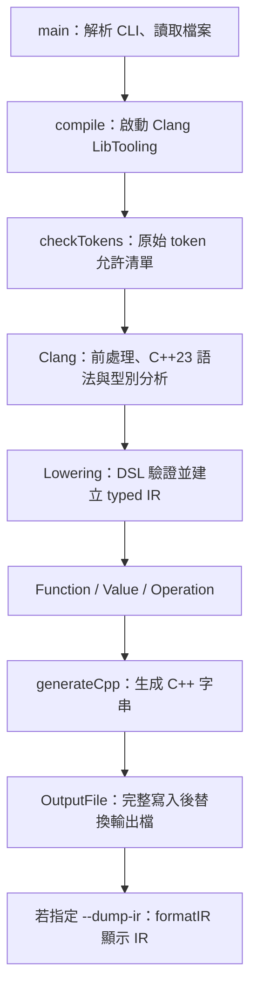

# DSL compiler 實作說明

另有 `--emit-objects` 模式，提供外部 event、context binding、function object 與 DSL 原始碼 library；其型別與呼叫規則見 [function-objects.md](function-objects.md)。下文主要描述既有 scalar 模式。

這份文件說明我如何把 [goal.md](../goal.md) 的需求實作成目前的 compiler、各模組負責什麼，以及後續 C++23 調整實際改了哪些程式。操作指令見 [README](../README.md)，環境與已執行的驗證結果見 [validation.md](validation.md)。實體 library 與多函數呼叫的最新設計見 [runtime-and-functions.md](runtime-and-functions.md)。數學函數、比較與條件選值的使用方式和分支實作見 [math.md](math.md)。

## 1. 完成的範圍

目前工具叫做 `dslc`，接受一份受限的 C++23 原始檔，檢查它是否符合 DSL，再生成另一份 C++23 原始檔。生成的程式由一般 C++ compiler 編譯，外部程式可以呼叫其中的 `compute`。

| 原始需求 | 實作結果 |
| --- | --- |
| 不自行寫 C++ parser | 使用 Clang LibTooling 取得 AST；入口的 token 檢查也使用 Clang Lexer。 |
| 只接受指定 DSL 子集 | 使用 token 及 AST 的允許清單，拒絕額外語法並提供位置與原因。 |
| 自訂 typed IR | `Function`、`Value`、`Operation` 表示函數、型別、參數、常數、運算及引用。 |
| 從 IR 生成 C++ | `generateCpp()` 只接受 `Module`，不接觸輸入原始碼或 Clang AST。 |
| 可顯示 IR、指定輸出檔 | CLI 提供 `--dump-ir` 與 `-o`。 |
| 保留浮點運算順序 | 保留 AST 的運算相依關係，每個運算生成獨立敘述，並指定後端編譯旗標。 |
| 完成建置與執行驗證 | 已建置 compiler，編譯、執行生成程式，並完成正向與拒絕測試。 |
| 使用 C++23 | Compiler 本身、DSL 解析模式及生成程式的編譯驗證都使用 C++23。 |

目前一份輸入是多函數 `Module`，需要一個使用者定義的 `compute` 入口，其他全域 DSL helper 可彼此呼叫。參數與回傳型別為 `double`，函數內接受已初始化的 `const double`／`const bool`、常數、值引用、四則運算、一元正負號、固定數學函數、比較、`?:` 及最後唯一的 `return`。這是在原始四則運算版本上依後續需求擴充的範圍。

完整語言邊界列在 README。這次沒有加入 LLVM IR、MLIR、JIT、binding、框架整合、FPGA 或最佳化。

## 2. 整體流程與模組分工



| 檔案 | 責任 |
| --- | --- |
| [src/main.cpp](../src/main.cpp) | CLI、檔案讀取、流程串接、錯誤退出碼、輸出檔生命週期。 |
| [include/dsl/frontend.h](../include/dsl/frontend.h) | `compile(source, filename)` 回傳 Module 的公開介面。 |
| [src/frontend.cpp](../src/frontend.cpp) | Clang action、token／巨集檢查、AST 驗證與 lowering。 |
| [include/dsl/ir.h](../include/dsl/ir.h) | Typed IR、bool、call 與 select region 的資料結構。 |
| [include/dsl/math.h](../include/dsl/math.h) | Runtime API metadata，用來驗證實體 header 的函數簽名及選擇呼叫目標。 |
| [runtime/include/dsl_runtime/math.h](../runtime/include/dsl_runtime/math.h)、[runtime/src/math.cpp](../runtime/src/math.cpp) | 公開 API 與實體函數定義，建成 `dsl_runtime` library。 |
| [src/ir.cpp](../src/ir.cpp) | IR 格式化、型別／運算名稱、精確浮點常數輸出。 |
| [include/dsl/codegen.h](../include/dsl/codegen.h)、[src/codegen.cpp](../src/codegen.cpp) | `generateCpp(module)`，從全部函數 IR 生成 C++ 字串。 |
| [include/dsl/visit.h](../include/dsl/visit.h) | 小型 `Overloaded` helper，組合 visitor 的各個 overload。 |
| [CMakeLists.txt](../CMakeLists.txt) | 版本與標準函式庫功能檢查、建置、連結、CTest。 |
| [cmake/build-info.txt.in](../cmake/build-info.txt.in) | Configure 時記錄實際版本、路徑及語言標準。 |
| [tests/integration.py](../tests/integration.py) | 呼叫真實 CLI、編譯生成結果、執行並比對、驗證拒絕與 I/O 行為。 |
| [examples/average.dsl.cpp](../examples/average.dsl.cpp)、[examples/driver.cpp](../examples/driver.cpp) | 驗收輸入，以及呼叫生成函數的外部程式。 |

邏輯上是「檢查 → IR」，實作上 `Lowering` 先收集並驗證所有函數簽名，再逐一走訪 body，一邊檢查、一邊建立 IR。遇到不允許的節點就停止，只有整份輸入成功才交出 `Module`；不會把建立到一半的 IR 送進 codegen。

## 3. 為什麼先檢查 token，再檢查 AST

Clang 會接受遠多於這份 DSL 的 C++ 語法，而且有些原始語法在 AST 中不容易看出來。例如前處理指令會先被處理，`#if 0` 內的內容根本不會進入 AST。

因此我分成三個位置檢查：

1. `checkTokens()` 使用 Clang raw lexer 掃描原始檔，只允許 DSL 所需的 token。非 literal include、`#define`、條件編譯、attributes 與其他關鍵字會在這裡被拒絕。空白與註解可以保留。Include callback 另以檔案身分限制為 runtime 或 `--extern-header` 登記的 header。
2. `MacroChecker::MacroExpands()` 檢查原始檔中的巨集展開，包含 `__DBL_MAX__` 等內建巨集。AST expression 的 macro location 也有檢查。
3. `Lowering` 檢查宣告、敘述及表達式的實際語意。例如 `=` token 可以出現在初始化，但 `a = b` 的賦值 AST 不被允許。

Token 檢查沒有解析運算優先序、宣告或函數結構；這些仍完全交給 Clang。也不提供任意 compiler flags 的 CLI 入口，DSL 的解析模式固定為 C++23。

### 宣告與函數本體

`HandleTranslationUnit()` 收集使用者的全域函數宣告與定義，要求有 `compute` 入口，每個 DSL 函數都在同一輸入找到定義，並拒絕 overload。實體 runtime header 與已登記外部 header 的 API 則另行記錄，只檢查宣告，不 lower 外部實作。簽名收集完成後才檢查各函數 body，包含未被呼叫的 helper。

Body 的最後一個敘述必須是 `ReturnStmt`；前面的敘述只能是符合規則的區域變數宣告。若提早出現 return、巢狀 block、空敘述或其他敘述，會直接拒絕。

### 表達式

`expression()` 依 Clang 節點種類處理：

| AST 節點 | 處理方式 |
| --- | --- |
| `FloatingLiteral` | 確認是有限的 double，建立 IR 常數。 |
| `CXXBoolLiteralExpr` | 建立 true／false 的 bool 常數。 |
| `DeclRefExpr` | 查詢已登記的 declaration，取得對應 value ID。 |
| `BinaryOperator` | 接受四則運算及六種比較；兩側都是 double，比較產生 bool。 |
| `UnaryOperator` | 只接受 double 的一元正負號。 |
| `CallExpr` | 接受實體 runtime API、本 module 的 DSL 函數或已登記的外部函數，檢查參數型別與數量。 |
| `ConditionalOperator` | 檢查 bool 條件，將兩側分開 lower 為 region，建立 `Select`。 |
| `ParenExpr` | 遞迴處理內部表達式；括號的結構已反映在 AST 中。 |
| `ImplicitCastExpr` | 只移除允許的讀值節點與 C++23 回傳時特定的 `NoOp`；拒絕數值轉型。 |
| 其他節點 | 回報位置及不支援的原因。 |

例如 `a + 1` 雖然是合法 C++，但整數 `1` 需要轉成 double，所以會被拒絕。`-1.0` 則已由新增的一元運算處理；呼叫 `pow(a, 2)` 仍因整數轉型被拒絕。

## 4. 自訂 IR 如何設計

IR 使用一般 C++ 資料結構，沒有引用 Clang 節點，也沒有使用 LLVM IR。最外層 `Module` 保存函數列表與入口 function ID；每個函數都有自己的 values 表。

```cpp
using Operation = std::variant<Parameter, Constant, BooleanConstant, Binary,
                               Unary, Reference, Call, Select>;

struct Value {
    Type type = Type::Double;
    Operation operation;
};
```

`Function::values` 是依序排列的 `Value`。Value 在 vector 中的索引就是 `ValueId`，所以 `%2` 表示第三個值。每個值都有 `Type::Double` 或 `Type::Bool`。Vector 是函數內的值表；實際執行順序由 region 的 instruction IDs 指定，不能把所有值無條件從頭執行。

| Operation | 保存的資訊 |
| --- | --- |
| `Parameter` | 輸入參數的來源名稱。 |
| `Constant`／`BooleanConstant` | 已由 Clang 解讀的 double／bool 值。 |
| `Binary`／`Unary` | 算術或比較種類，以及 operand value IDs。 |
| `Call` | Runtime API enum、DSL function ID 或 external function ID，以及參數 value IDs。 |
| `Select` | bool 條件 ID、true 與 false 兩個 region。 |
| `Reference` | 區域變數名稱及其初始化結果的 value ID。 |

`Function` 另外保存函數名稱、回傳型別與 `body` region。每個 `Region` 保存要執行的 instruction IDs 和 `result`；`Function::body.result` 是回傳值。`Select` 只執行被選中的 region 並取得其 result，沒有引入任意跳躍或一般控制流程圖。

### 變數如何綁定

`bindings_` 將 Clang 的 `ValueDecl*` 對應到 `ValueId`。使用 declaration identity 可以直接沿用 Clang 對名稱的解析結果。

參數一開始就登記。區域變數則先處理 initializer，成功後才建立 `Reference` 並登記。因此 `const double x = x;` 無法透過自己尚未完成的初始化。

`Reference` 表示一次區域名稱綁定；每次讀取這個變數時，直接使用其 value ID，不會重複產生新的 binding。

### IR 的有效性由誰保證

目前由 frontend 保證參數先建立、operand 指向已建立且在作用域內的值、region 結果有效。Codegen 接受的是 frontend 成功建立的 IR；尚未提供外部 IR 載入或獨立 IR verifier。

Module 另保存外部函數宣告、實際引入的 header 路徑與需隔離的巨集名稱。Codegen include 真實 header，輸出限定名稱呼叫；C／C++ ABI 交給 host compiler。詳細設計與連結範例見 [external-functions.md](external-functions.md)。

## 5. 用驗收範例走一次完整轉換

輸入：

```cpp
double compute(double a, double b) {
    const double sum = a + b;
    return sum * 0.5;
}
```

主要 AST 結構可簡化為：

```text
FunctionDecl compute
├─ ParmVarDecl a : double
├─ ParmVarDecl b : double
└─ CompoundStmt
   ├─ DeclStmt
   │  └─ VarDecl sum : const double
   │     └─ BinaryOperator +
   │        ├─ 讀取 a
   │        └─ 讀取 b
   └─ ReturnStmt
      └─ BinaryOperator *
         ├─ 讀取 sum
         └─ FloatingLiteral 0.5
```

這是方便閱讀的結構示意，省略了 Clang 的讀值 implicit cast，不是逐字的 AST dump。

Lowering 依序建立以下值：

| 步驟 | AST／來源內容 | IR |
| --- | --- | --- |
| 1 | 參數 `a` | `%0 = param a` |
| 2 | 參數 `b` | `%1 = param b` |
| 3 | initializer 的 `a + b` | `%2 = add %0, %1` |
| 4 | `sum` 的名稱綁定 | `%3 = ref %2 (sum)` |
| 5 | `0.5` | `%4 = constant 0x1p-1` |
| 6 | `sum * 0.5` | `%5 = mul %3, %4` |
| 7 | 最後的 return | `body.result = 5` |

`0x1p-1` 是 0.5 的精確十六進位表示。IR 保存的是數值，顯示與 codegen 才重新格式化它，沒有保存並貼回來源的 `0.5` 字串。

`generateCpp()` 先輸出所有函數的 prototype，再為各函數依 region 遍歷指令，用 `std::visit` 決定輸出。分支指令只在對應 region 內生成；這個不含分支的範例得到：

```cpp
double compute(double v0, double v1) {
  const double v2 = (v0 + v1);
  const double v3 = v2;
  const double v4 = 0x1p-1;
  const double v5 = (v3 * v4);
  return v5;
}
```

生成名稱使用 `v` 加上 value ID，因此不依賴來源變數名稱，也不會因使用者命名為 `v0` 而撞名。Codegen 直接回傳 `std::string`，由 CLI 決定寫到哪裡。

## 6. 如何保留浮點運算

括號與優先序由 Clang 解析。例如 `a + b * c` 的加法引用乘法結果；`(a + b) * c` 則是乘法引用加法結果。Lowering 保留這些相依關係，不做代數重排。

每個 binary value 生成獨立的 `const double` 敘述。常數由 `doubleLiteral()` 使用 `std::format` 的十六進位格式輸出，不指定會截短精度的位數；負號的位置也明確處理，包含負零。

生成結果仍需要以下編譯方式：

```sh
g++ -std=c++23 -O2 -fno-fast-math -ffp-contract=off \
  -Iruntime/include build/average.cpp examples/driver.cpp \
  build/runtime/libdsl_runtime.a -o build/average
```

`-fno-fast-math` 避免允許改變浮點語意的代數重排，`-ffp-contract=off` 關閉乘加收縮。這些旗標是使用生成結果的條件；codegen 本身不能控制外部 compiler 的選項。

目前以 IEEE-754 binary64 與一般預設浮點環境為前提。沒有另外處理動態 rounding mode 或跨架構的 extended precision；執行時的除零、Inf、NaN 遵循一般 double 運算。

## 7. C++23 調整實際做了什麼

這部分分兩階段完成，兩者都已反映在目前原始碼中。

### 第一階段：語言模式與 AST 相容

先將 CMake 的 `CMAKE_CXX_STANDARD`、LibTooling 的 `-std=` 參數，以及生成程式的測試編譯選項全部設為 C++23。

測試隨即發現：直接回傳參數或區域變數時，Clang 的 C++23 AST 會多出 `NoOp` lvalue-to-xvalue 節點。原先的允許清單會把它拒絕。我檢查實際 AST 後，加入限定條件：必須是相同 double 型別、從 lvalue 到 xvalue，而且 operand 是變數引用，才可移除這一層。

既有直接回傳測試與新增的括號回傳測試都驗證了這項調整。第一階段主要解決標準設定及 AST 差異，沒有全面改寫程式風格。

### 第二階段：重構實作寫法

| 原先方式 | 現在方式 | 改動的目的 |
| --- | --- | --- |
| 連續 `std::get_if` 判斷 operation | `std::visit` + `Overloaded` | 每一種 operation 都有明確處理；遺漏新的 alternative 會在編譯時被發現。 |
| 手動遞增索引再取值 | `std::views::enumerate` + structured bindings | 直接取得 ID 與引用。 |
| 串流拼接 IR／生成程式 | `std::format`，函數直接回傳字串 | 格式與資料對應更容易閱讀，I/O 留給呼叫端。 |
| `main` 裡直接解析並報錯 | `parseOptions()` 回傳 `std::expected<Options, std::string>` | 分開參數解析與錯誤呈現。 |
| 各錯誤路徑手動清理暫存檔 | RAII `OutputFile`，寫檔回傳 `std::expected<void, std::string>` | 集中處理資源生命週期及失敗原因。 |
| argv 手動索引、部分字串複製 | `std::span`、`std::string_view` | 在有效生命週期內借用資料。 |
| IR aggregate 位置式初始化 | designated initializers | 建構時可直接看出各欄位用途。 |
| 沒有標示需使用的回傳值 | `[[nodiscard]]` | 讓忽略重要結果更容易被 compiler 提醒。 |

這些是適合本專案的現代 C++ 寫法，並非每項功能都始於 C++23。Clang AST 的非擁有指標與 `llvm::dyn_cast` 仍配合 LibTooling 的物件模型；不能把 Clang 擁有的 AST 節點改由自己的 `unique_ptr` 釋放。

`compile()` 仍回傳 `std::optional<Module>`，因為詳細診斷已交給 Clang 發出。CLI／I/O 則需要把原因帶回呼叫端，所以使用 `std::expected`。

生成的 kernel 使用直接的 double／bool 計算；數學呼叫連結實體 `dsl_runtime` library，條件 region 使用立即呼叫的 lambda 和 if／else，確保只有被選中的分支執行。

### 工具鏈也需要相符的標準函式庫

本機 Clang 20.1.8 原先自動使用 GCC 11 的標準函式庫標頭；實際試編譯時找不到 `<expected>`。因此我改用現有 GCC 16.1.0／libstdc++ 16.1.0 建置 compiler，DSL 解析仍連結 Clang LibTooling 20.1.8。

CMake 也加入實際編譯、連結的功能檢查，確認 expected、format、print、enumerate 可用。LLVM package 以 20.1.8 `EXACT` 查找，Clang 標頭也檢查相同版本；實際路徑記在 `build/build-info.txt`。

## 8. 錯誤處理與輸出檔

Clang 的 parser／型別錯誤使用原生診斷；DSL 自訂錯誤透過 `DiagnosticsEngine` 發出 `DSL: ...`，並附上 AST 或 token 的原始位置。

CLI 在開始生成前檢查輸入與輸出是否為同一檔案，包含檔案別名。成功取得 IR 後，先完整生成字串，再建立輸出路徑旁的暫存檔；寫入成功才呼叫 LLVM `TempFile::keep()` 替換目標。

若編譯失敗，根本不會建立生成輸出。若寫入或替換失敗，RAII 物件負責 discard 暫存檔。`--dump-ir` 的 stdout 輸出也放在寫檔成功之後，避免失敗時仍印出成功結果。

## 9. 如何確認實作正確

測試直接執行 `dslc`，沒有用假的 frontend 或 codegen 代替。

對成功案例，測試先生成 C++，再把生成程式、重新命名函數的原始 C++ reference、測試 driver 一起交給 host compiler 編譯。執行時同時比較原始版本與已知預期值，使用 double 的位元表示檢查結果，因此也能區分正零與負零。

拒絕案例檢查非零退出碼、診斷原因、檔名／行／欄、沒有 IR stdout，以及既有輸出檔內容未被改動。I/O 測試另涵蓋找不到輸入、無效輸出目錄、同檔案與 symlink 保護、暫存檔清理。

最近一次已記錄的完整驗證結果為：

| 項目 | 結果 |
| --- | --- |
| Compiler 建置 | GCC 16.1.0、C++23，6 個 translation units 成功編譯並連結。 |
| CTest | 2 個 entries、32 個 Python unittest 方法，全部通過；實測結果見 [validation.md](validation.md)。 |
| 資料驅動運算案例 | 58 組，包含優先序、括號、引用、重結合／FMA 敏感輸入及浮點邊界。 |
| 基本語法拒絕案例 | 98 組；外部介面另有 22 組表列拒絕案例及 header／CLI 檢查。 |
| 驗收範例 | 原始平均值範例輸出 `3`；數學範例輸出 `5`，退出碼均為 0。 |
| 多函數與 runtime | 9 組 module 案例、普通 C++ 直接 link、漏連結失敗及 header 身分檢查。 |
| 分支與數學邊界 | 四組未選分支的浮點例外／errno 檢查，以及 NaN／Inf 執行測試，均通過。 |

上述是實體 runtime 與多函數擴充完成後，重新執行的實際測試紀錄。完整環境、命令與結果在 [validation.md](validation.md)。

## 10. 建議如何閱讀原始碼

先讀 [ir.h](../include/dsl/ir.h)，理解 compiler 最後要建立的資料；再用本文件的驗收範例對照 [frontend.cpp](../src/frontend.cpp) 的 `HandleTranslationUnit()` 與 `expression()`；接著看 [codegen.cpp](../src/codegen.cpp)，確認每種 IR operation 如何生成 C++。

最後閱讀 [main.cpp](../src/main.cpp) 的流程串接與錯誤處理，以及 [integration.py](../tests/integration.py) 的正反案例。這樣可以先掌握「資料怎麼轉換」，再看 CLI 和工具鏈細節。


## Object 模式新增的控制流程與合約

Object frontend 將 `if`、block、賦值、聚合初始化、typed return/error 建立成 `If`、`Scope`、`Store`／`FieldStore`、`RecordInit`、`Return` IR；bool 的 `&&`／`||` 以 `Select` 保存短路的兩個 region。Function metadata 記錄 result／state／error record 與明確的 state parameter。Scalar 模式仍使用原來的 region result。

在展開前，`resolveContracts` 沿 DSL call graph 檢查遞迴及傳播 error 型別，拒絕不相容的 error contract。Object lowering 把每個 helper 呼叫展開成 `Invoke` region，保留 return 邊界；值參數先複製，state 另有工作副本。Child 成功才把 new_state 複製回 caller 工作 state；child error 向外回傳。外層 unit 負責最後提交。

Object codegen 為 `Invoke` 生成回傳 child `contract::response` 的區域 lambda，並檢查及傳播 expected。`Select` 則生成直接的 if/else statement，讓分支內的 error 能離開所屬 operation。所有計算由 IR 生成；不把原始 source throw 或 function body 貼到輸出。

Context 分析另外追蹤會被修改的 local，拒絕依賴這些值或 state 的 provider argument。Provider 出現在條件分支、提前退出之後，或可能失敗的 helper 之後也會拒絕。這項檢查採保守規則，不做路徑可達性最佳化。

[src/config.cpp](../src/config.cpp) 使用 LLVM 的 JSON parser，載入相對於設定所在目錄的依賴，遞迴處理 imports、偵測循環與錯誤 schema。結果以 `std::expected` 回傳，再與 CLI options 累加。設定不含可執行腳本。

使用規則與限制見 [state-and-errors.md](state-and-errors.md) 及 [library-config.md](library-config.md)。
