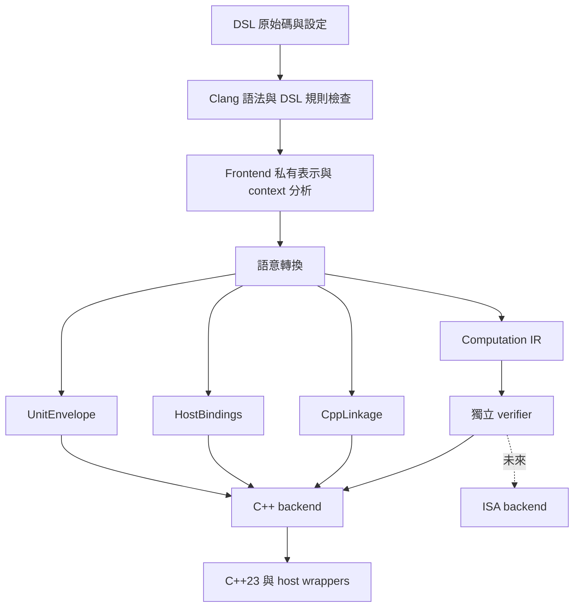

# 共用 IR 與 backend 邊界

沒有 compiler 背景的讀者，建議先讀 [從零理解這個 DSL compiler](compiler-from-zero.md)：以實際範例逐步說明各層，並對照 Clang／LLVM。

目前 compiler 將計算語意、C++ 連結、host 資料取得與 unit 包裝分開。C++ backend 已使用這套共用 IR 生成程式；未來 ISA backend 可以直接使用 `dsl_ir`，不必引入 Clang、C++ header 或 `std::expected`。

這次重構保留現有 DSL 語法與執行行為。`--dump-ir` 改為新的 `computation_ir v1` 格式；它是除錯輸出，尚不是可載入的序列化格式。

## 編譯流程



[program.h](../include/dsl/program.h) 的 `Program` 是編譯結果的集合，各部分責任如下：

| 部分 | 內容 | 不負責的事情 |
| --- | --- | --- |
| `ir::Module computation` | 型別、精確常數、邏輯外部介面、函數、值、OP、region、terminator | C++ 名稱、include、context 取得、unit 提交 |
| `CppLinkage cpp` | 真實 header、巨集隔離、外部 C++ symbol、record／field 的 C++ 名稱與預設值映射 | 決定 computation 的運算或控制流程 |
| `HostBindings bindings` | 哪個核心參數由哪個 provider 準備，provider 的 event／常數引數 | 執行核心運算或讀取核心暫存值／state |
| `UnitEnvelope units` | 對外 export、event 參數集合、state 參數與初值 | 定義核心 OP 或固定實體記憶體 layout |

`debugName` 與 operation 的 `location` 用於診斷。函數、外部介面及型別的身分由 ID 決定，不靠除錯名稱解析。C++ backend 接受整個 `Program`，共用 verifier 只接受 `ir::Module` 與 registry。

## 1. 型別、常數與 ID

[ir.h](../include/dsl/ir.h) 使用不同的強型別 `TypeId`、`ValueId`、`OperationId`、`FunctionId`、`ExternalId`、`ConstantId`、`FieldId`。不能把 FunctionId 隱式當成 TypeId。

型別表的 entry 是互斥的 variant：

- `BoolType`。
- `IntegerType{width, signedness}`：目前共用 verifier 接受 1–64 bits，明確區分 signed／unsigned。
- `FloatType{format}`：IEEE-754 binary32 或 binary64。
- `RecordType{fields}`：每個欄位以 `FieldId` 與 `TypeId` 表示，不含 C++ 欄位名稱。

因此沒有「double 卻附帶 recordName」的組合。型別等價目前採 TypeId identity；frontend 負責重用同一型別的 ID，不做跨 module 的結構型別合併。

TypeId、FunctionId、ExternalId、ConstantId 在 module 內有效；ValueId 與 OperationId 在函數內有效；FieldId 在所屬 record 內有效。ID 不受除錯名稱更改影響，但重排／刪除表格必須同步 remap 引用。這不是跨檔案或跨版本的永久 ID，未來 importer／serializer 必須明確實作 remapping。

Scalar 常數保存型別與精確 numeric bits，aggregate 常數引用其他 ConstantId。負零與浮點位元不經來源文字往返；C++ backend 才轉成 hexfloat 或 bit_cast。Signed integer bits 採二補數表示。

共用型別不保存 C++ padding、alignment、欄位 offset 或 ABI。Record 是有限的值集合，不允許遞迴的 by-value 型別。目前 DSL 的對外資料仍限制為平坦 scalar 欄位；ISA backend 必須另外定義 packing、endianness、對齊與 target 合法型別，不能直接把 C++ struct bytes 當成硬體 ABI。

## 2. 統一 OP 與語意登記

每個非 terminator 的 operation 都使用同一結構：

```cpp
struct Operation {
    OperationId id;
    OpCode code;
    std::vector<ValueId> operands;
    std::vector<ValueId> results;
    Attribute attribute;
    std::vector<Region> regions;
    std::string location;
};
```

[registry.cpp](../src/registry.cpp) 統一登記 opcode、顯示名稱、驗證規則與 effect 分類。四則運算、數學函數、call、record 操作與 structured control 都走這個介面。數學 OP 是 `Sqrt`／`Pow` 等語意，不是 C++ symbol；`Call` 帶 FunctionId，`ExternalCall` 帶 ExternalId。

| OP 類別 | 型別／結果規則 | 語意 |
| --- | --- | --- |
| Constant／Identity | 一個 typed result | 常數或既有不可變值 |
| 算術／數學 | 同格式浮點 operand 與 result | 保留逐步浮點求值，不允許重結合或自動 FMA |
| 比較 | 同型別浮點或整數 → bool | 有序的數值比較；NaN 的等於為 false、不等於為 true |
| Not | bool → bool | 邏輯反相 |
| Aggregate | 欄位型別序列 → record | 建立新 record 值 |
| Extract／Insert | FieldId 選取欄位 | 讀取欄位／回傳替換該欄位的新 record，不改動輸入 |
| Call／ExternalCall | 依 target signature，可有零或多個 result | 執行呼叫；typed failure 傳播到目前 return 邊界 |
| If／Scope | 子 region 以 Yield 交付 result | 只執行所選路徑，允許提前 success／error |
| Evaluate | 子 region 以 ReturnSuccess 交付 result | 帶獨立 return 邊界的內嵌計算，failure 向外傳播 |

數學 `Min`／`Max` 採 fmin／fmax 的 NaN 選值規則；`Round` 的 halfway 採 away from zero。其他數學 OP 延續現有 double runtime 的函數意義。不同平台 libm 的超越函數最後幾個 bits 並沒有跨 target 一致的保證。未來 ISA 若需要逐位元相容，仍需建立 target 數學實作及相容性測試。

Effect 分為 `None`、`FloatingEnvironment`、`External`、`Derived`。浮點及比較採保守的浮點環境 effect，外部函數視為可能有副作用，call／control 的 effect 需由 callee／region 推導。**目前沒有實作 effect 推導 pass 或 optimizer**；執行順序由 region 的 operation 序列保留，不能因為結果沒被使用就刪除外部呼叫或可能影響浮點環境的 OP。

Registry 集中的是共用 OP 身分與驗證契約；frontend 仍需把語法映射到 opcode，各 backend 仍需實作 lowering。它不是可以任意載入新語意的 plugin registry。新增 OP 時需同時定義共用規則、語意及各 backend 的支援或拒絕行為。

## 3. Value、operation 與 terminator 分離

`Function::values` 只保存每個 ValueId 的 TypeId。參數或 operation 的 results 定義值；operation 自己有獨立 OperationId，可以有零、一或多個結果。控制流程不再被包成假的 double value。

每個 region 必須有獨立 terminator：

- `ReturnSuccess{values}`：離開目前函數或 Evaluate 邊界，回傳 signature 指定的成功結果。
- `ReturnError{error}`：離開目前邊界，產生相符型別的 failure。
- `Yield{values}`：離開 If／Scope 的分支，交付該 operation 的結果。
- `Unreachable`：標示前一個 structured operation 已使所有路徑退出，沒有後續 continuation。

If／Scope 不新增 return 邊界；其中的 early return 仍離開所屬函數／Evaluate。Evaluate 新增 return 邊界，例如內嵌 helper 的 return 只結束 helper。Evaluate 的 error 型別必須能傳播到父邊界。

Region 可捕捉已定義的祖先值，不能引用 sibling region 的值，也不能在自己的 region 內讀取尚未產生的 operation result。分支內定義的值必須經 Yield／ReturnSuccess 才能成為外部可使用的 operation result。

DSL surface 目前用 `throw Error{...}`；若以後新增 `fail(...)`，只需 frontend 轉成相同 ReturnError，無須更改 backend 的 error 模型。共用 IR 不包含 C++ exception unwinding 或 std::expected。

## 4. State 是值流

以下是概念 IR，省略完整型別表與 debug dump 的值宣告：

```text
func Accumulator(value: f64, state: State) -> (f64, State) {
  old_total = extract state, field(total)
  total = add old_total, value
  next_state = insert state, field(total), total
  return_success total, next_state
}
```

`state` 是普通不可變參數，`next_state` 是普通結果。只有 UnitEnvelope 知道哪個參數代表持久 state，以及第二個成功結果代表 new_state。共用 Module 不含 Store、FieldStore、StateCopy、StateView 或 Invoke。

Frontend 的變數賦值改為更新 ValueId 綁定，欄位賦值改為 Insert，跨 if／scope 的更新透過 Yield 合併。子計算成功後返回的新 record 以 Extract／Insert 合成父計算的下一個 state。子計算失敗則沒有成功結果，不會發布這條 state 值流。

C++ backend 可以用區域 record 副本與欄位賦值實作 Insert；runtime unit 在成功回應時提交 new_state。工作副本、tuple、expected、lambda 都是 C++ 實作選擇。未來 ISA 可以用暫存器、mux 或其他儲存策略實作相同的值流。

目前 object frontend 為了分析完整 context 需求，會在自己的 source planning 階段展開 helper，再轉成 Evaluate。Scalar 呼叫保留 Call。因此 object 輸出的核心 IR 包含內嵌計算邊界，尚未保留全部來源 call graph 供最佳化；未來可以新增保留 Call 的 context-parameter threading pass，而不用重新把 C++ unit 模型塞進核心。

## 5. 獨立 verifier 與 backend capability

```cpp
auto checked = dsl::ir::verify(module, dsl::ir::registry());
if (!checked) {
    // checked.error() 包含函數／位置與失敗原因
}
```

[verify.cpp](../src/verify.cpp) 不依賴 frontend，檢查：

- 型別與 ID 越界、數值格式、欄位唯一性、遞迴型別、常數位元／aggregate 型別與循環。
- Value 定義唯一性、參數與 signature 一致、operand dominance、region captures、未定義值。
- OP 是否登記、attribute 類型、arity、operand／result type、region 數量、call target 與 signature。
- 每個 region 的 terminator、成功結果與 error 型別、Yield 位置、全路徑終止與終止後的無效指令。

公開 `compile()` 回傳前驗證，CLI 在交付 backend 前驗證，C++ `generate()` 也自行驗證，避免直接 API 呼叫繞過檢查。未來 optimization、import 或第二 frontend 產出的 IR 都必須重新 verify。

C++ backend 要求至少一個 export，並以字典序最小的 export 名稱建立 `dsl_backend::module_<name>`，隔離不同 bundle 的內部 FunctionId。這是 backend 命名策略，不是共用 Module 的身分或 TypeId 規則；完整限制見 [工作紀錄](roadmap.md)。

共用 IR 合法不代表每個 target 都支援。C++ backend 在 verify 後另檢查 C++ metadata 與 capability，例如核心接受 binary32，目前 C++ backend 明確拒絕，僅生成 binary64。核心可表示巢狀 record，目前 C++ backend 明確限制為平坦 record，避免把未支援的布局送到 host compiler。核心可表示 1–64-bit 整數，目前 C++ backend 只接受 32-bit signed／unsigned；現有 DSL surface 只提供 signed int32。整數算術尚未定義，不能把 float Add 套到 integer。

目前 C++ external ABI 限制為單一成功結果、無 typed error；核心的邏輯 external signature 與之分離。Object provider 的 header／symbol 由 host binding 使用，不會混成計算 region 中的 ContextRead。Scalar 模式直接外部呼叫則保留 ExternalCall 及其 effect。

## 6. Frontend 的私有過渡表示

[src/frontend_ir.h](../src/frontend_ir.h) 是 **Clang frontend 內部的 source planning 結構**，仍保留來源名稱、Store、StateCopy、StateView、Invoke 等資訊，方便驗證 C++ 子集、分析 mutable local 與 provider 限制。它不是公開 computation IR，backend 不接受也不 include 這個檔案。

[src/semantic.cpp](../src/semantic.cpp) 負責把它轉成新的 typed value flow，並拆出三份 metadata。[src/frontend_bindings.cpp](../src/frontend_bindings.cpp) 只做 frontend 的呼叫展開、context 分析及合約檢查。舊的 objects.cpp 生成器已移除，所有 C++ 生成集中在 [src/codegen.cpp](../src/codegen.cpp)。

保留私有 source 表示讓既有 DSL 拒絕規則與 context 分析能繼續使用；要新增 backend 只需閱讀公開 IR，不必理解這個中間階段。

## 7. 不依賴 Clang 的建置與後續工作

```sh
cmake -S . -B build-core -G Ninja \
  -DDSL_BUILD_COMPILER=OFF -DCMAKE_BUILD_TYPE=Release \
  -DCMAKE_CXX_COMPILER=g++ -DCMAKE_C_COMPILER=gcc
cmake --build build-core -j2
ctest --test-dir build-core --output-on-failure
```

此模式建立 `dsl_ir`、`dsl_cpp_backend` 與兩組直接 API 測試，不查找 LLVM／Clang，也不建立 CLI 或 runtime。新 backend 可以只 link `dsl_ir`；C++ metadata 與 frontend 都不是它的必要依賴。

目前已完成共用資料模型、語意轉換、獨立驗證及 C++ backend 遷移。尚未實作 ISA lowering、target data layout、serialization、optimization pipeline、動態 OP plugin、error handling region 或多 error union。未來加入這些功能時，應擴充共用語意或 target 專屬 metadata，並為各邊界新增 verifier／capability 測試。
